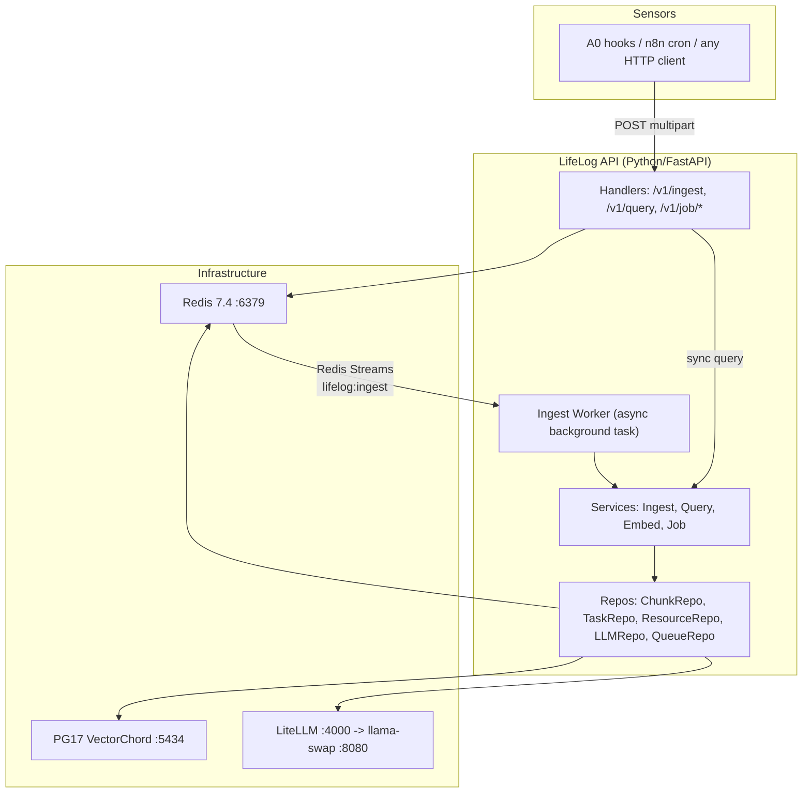
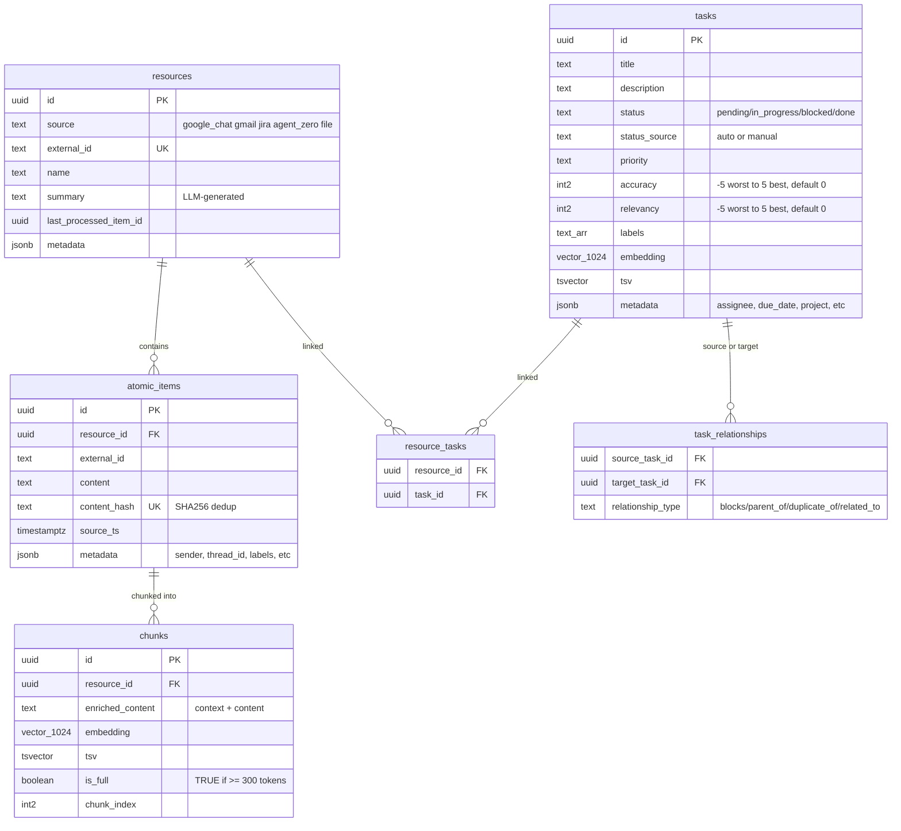
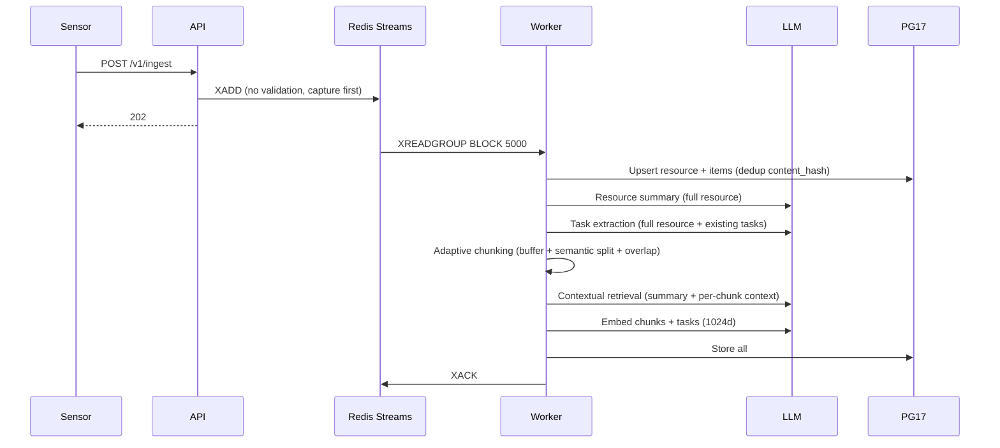

# LifeLog - Architecture Design

> Standalone personal knowledge retrieval API. Sensors push raw data; the server does all intelligence. Self-hosted on Strix Halo homelab.

## System Architecture

**Key decisions:** Single container (API + worker). Clean Architecture (Handler -> Service -> Repository -> Model). Redis Streams for async ingestion. 1024d embeddings via Matryoshka truncation. No auth (internal network only).

## Models

| Model | Purpose | Native Dim | Used Dim |
|---|---|---|---|
| **Qwen3-Embedding-4B** (Q8_0) | Embedding | 2560 | 1024 (MRL truncation in app code) |
| **Qwen3-Reranker-4B** (Q8_0, VooDisss) | Re-ranking | - | - |
| Qwen3.5-35B | LLM (summary, tasks, chunking, context) | - | - |

## Data Model

**n:n resources-tasks:** A task can span multiple resources (same action in email + chat). **Directional relationships:** `blocks` means source prevents target; inverse derived in code (no `blocked_by` row).

## API Endpoints

| Method | Path | Purpose | Response |
|---|---|---|---|
| `POST` | `/v1/ingest` | Multipart: JSON metadata + optional files (PDF/DOCX) | `202` (queued) |
| `POST` | `/v1/query` | Hybrid search (chunks + tasks) | `200` |
| `POST` | `/v1/job/gchat` | Trigger Google Chat sync (n8n cron) | `202` |
| `POST` | `/v1/job/gmail` | Trigger Gmail sync (n8n cron) | `202` |
| `POST` | `/v1/job/jira` | Trigger Jira sync (n8n cron) | `202` |
| `GET` | `/health` | Liveness check | `200` |

## Ingestion Pipeline

**Order matters (dependencies):** Persist -> Summary -> Tasks -> Chunk -> Context -> Embed -> Store

**Worker:** Single asyncio background task. `XREADGROUP` blocking read, 1 message at a time. Unacked messages redeliver after 5 min. DLQ after 3 failures. Idempotent via content_hash.

## Adaptive Chunking

Data: Google Chat avg 108 tokens/msg, Gmail avg 220 tokens/email. Most items are SHORT.

| Param | Value | Why |
|---|---|---|
| MIN_CHUNK | 300 tokens | Below this, embedding quality degrades |
| MAX_CHUNK | 500 tokens | Above this, semantic precision drops |
| OVERLAP | 20% | Context preservation across boundaries |

**Algorithm:**
1. Find `is_full=FALSE` chunk for resource -> delete it, put its items back in buffer
2. Add new items to buffer
3. For each item: if > MAX_CHUNK, LLM semantic split into 300-500 segments. Otherwise accumulate in buffer, emit as chunk when buffer >= MIN_CHUNK
4. Trailing chunk gets `is_full=FALSE`
5. Apply 20% overlap between adjacent chunks (prepend last 20% of previous chunk)
6. Prepend resource summary + LLM context per chunk

**Incremental ingestion:** Only new atomic items processed. Unfull trailing chunk is reopened (deleted + re-chunked with new items). Full chunks are immutable.

## Retrieval Pipeline

Every query searches BOTH chunks and tasks in parallel (always-on dual search, ~215ms overhead for tasks).

All top-N values are configurable via settings (defaults shown):

1. Embed query (1024d, shared)
2. Parallel: Chunk hybrid (dense top 50 + BM25 top 50 -> RRF) | Task hybrid (top 20 + 20 -> RRF)
3. Re-rank: chunks top 50 -> 20, tasks top 20 -> 20
4. Lost-in-Middle reorder chunks
5. Task relevance threshold filter (accuracy >= 0, relevancy >= 0)
6. Compose: separate sections (Context / Tasks)

## Scheduling

| Source | Trigger | Frequency |
|---|---|---|
| Google Chat | n8n -> `POST /v1/job/gchat` | Every 5 min |
| Gmail | n8n -> `POST /v1/job/gmail` | Every 15 min |
| Jira | n8n -> `POST /v1/job/jira` | Every 1 hour |
| Agent Zero | `monologue_end` hook -> `POST /v1/ingest` | Event-driven |

Job endpoints run source-specific sync logic internally (fetch from APIs using stored credentials), push to Redis Streams, return `202` immediately.

## Task Model

- Extracted from **full resource** (not chunks) - 1 LLM call per resource
- Tasks n:n with resources (junction table)
- Full re-extraction when new items arrive (LLM sees all items + existing tasks)
- Auto-status advances only (pending -> in_progress -> done, never regresses)
- `status_source = 'manual'` overrides are NEVER touched by auto-update
- Dedup: cosine > 0.85 + BM25 title match -> update; else create
- Labels: KIV, important, done, irrelevant, follow-up, custom (`project:X`)

## Techniques

**Phase 1 (ADOPT):** Contextual Retrieval (-67% failures), Semantic Chunking (+9% recall), Adaptive Chunking (is_full), Resource Summary, Task Extraction, Hybrid Search (+10-30% MRR), Re-Ranking (+15-40% NDCG@10), Always-On Dual Search, Lost-in-Middle, Matryoshka 1024d

**Phase 2 (EVALUATE):** HyDE, Multi-Query Expansion, Reverse HyDE, Parent Document Retrieval - triggered by recall < 0.7

**Phase 3+ (DEFER):** Late Chunking, ColBERT, RAPTOR, Knowledge Graph, LLM Query Classification

## Storage (1024d)

| Scale | Total |
|---|---|
| Current (5.5K docs) | ~126 MB |
| 10x | ~1.3 GB |
| 100x | ~12.5 GB |

## Phases

| Phase | Scope | Status |
|---|---|---|
| 0: Infrastructure | PG17, Qwen3 4B models, LiteLLM | **COMPLETE** |
| 1: Foundation | API server, schema, worker, first job | **COMPLETE** |
| 2: Sensors | gchat/gmail/jira jobs + n8n | **COMPLETE** |
| 3: Agent Integration | A0 search tool, task labels | Pending |
| 4: Quality | 50 test queries, tune, Phase 2 techniques | Pending |
| 5: Expansion | Confluence, PDF/DOCX, Cursor MCP | Pending |

## References

| Source | Link |
|---|---|
| Contextual Retrieval | [Anthropic 2024](https://www.anthropic.com/news/contextual-retrieval) |
| Semantic Chunking | [ScienceDirect 2025](https://www.sciencedirect.com/science/article/pii/S0950705125019343) |
| Hybrid + Re-Ranking | [NVIDIA 2026](https://developer.nvidia.com/blog/enhancing-rag-pipelines-with-re-ranking/) |
| Chunking Best Practices | [Firecrawl 2026](https://www.firecrawl.dev/blog/best-chunking-strategies-rag) |
| Lost-in-Middle | [Redis 2026](https://redis.io/blog/10-techniques-to-improve-rag-accuracy/) |
| Always-On Dual Search | [ScienceDirect 2026](https://www.sciencedirect.com/science/article/pii/S0278612526001020) |
| Qwen3-Embedding-4B GGUF | [HuggingFace](https://huggingface.co/Qwen/Qwen3-Embedding-4B-GGUF) |
| Qwen3-Reranker-4B GGUF | [VooDisss](https://huggingface.co/VooDisss/Qwen3-Reranker-4B-GGUF-llama_cpp) |
