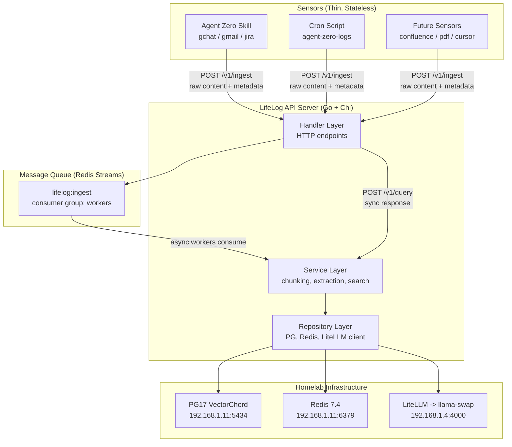
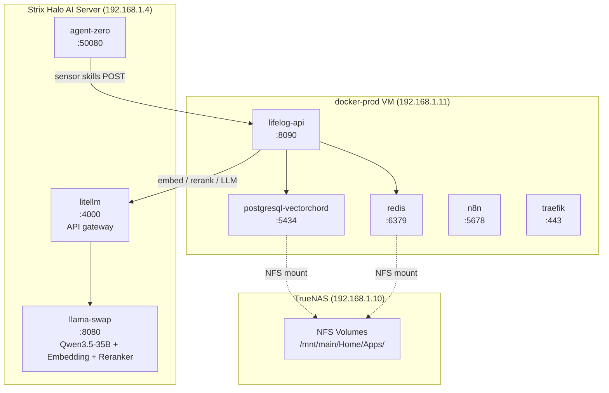
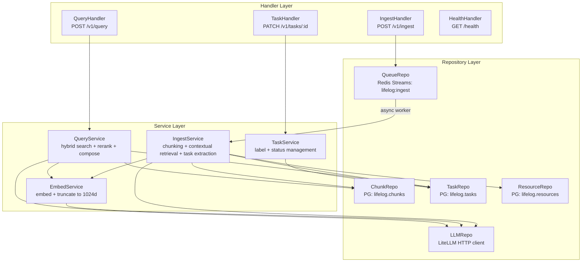
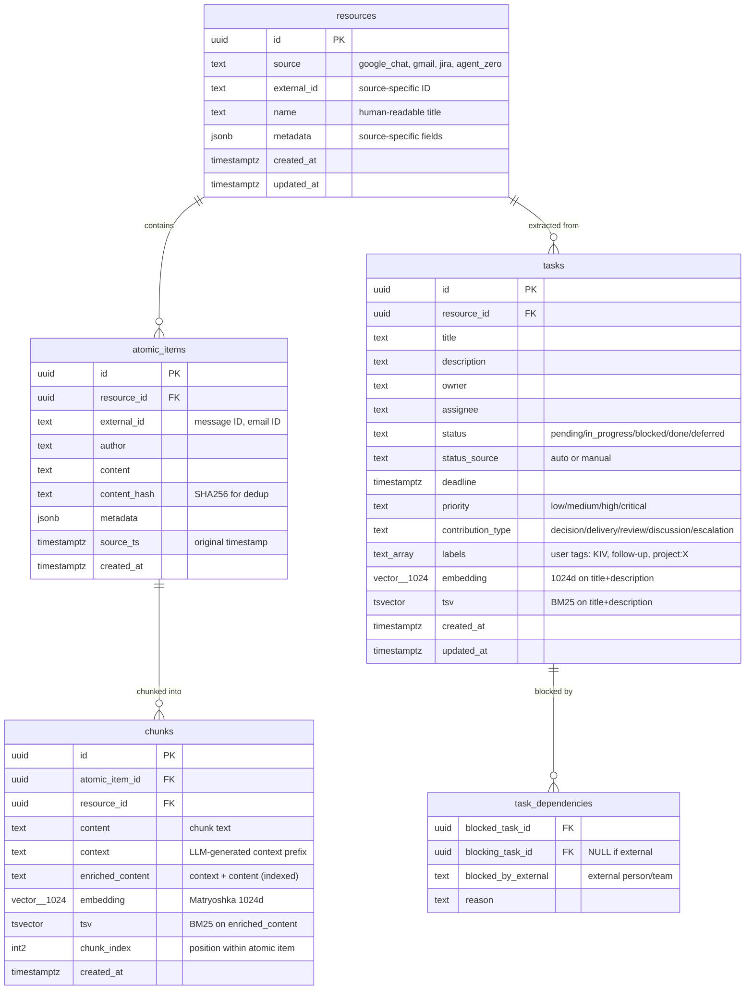
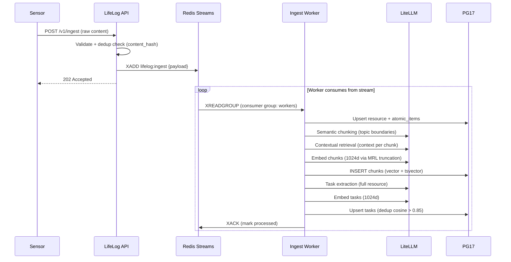
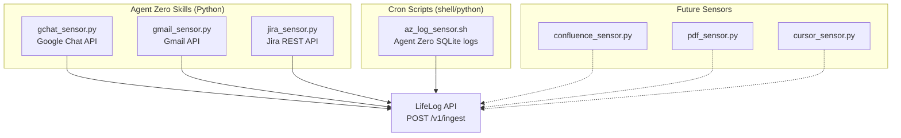
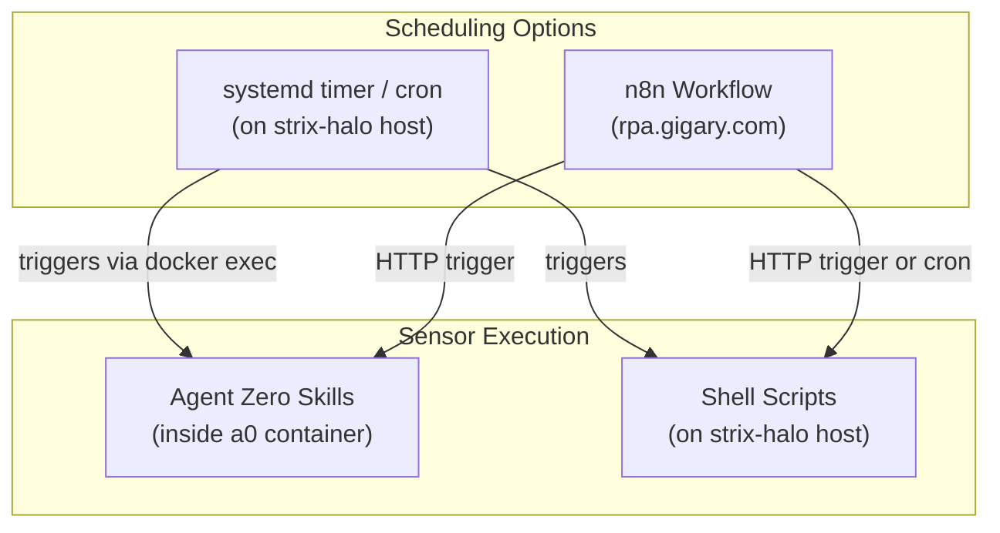
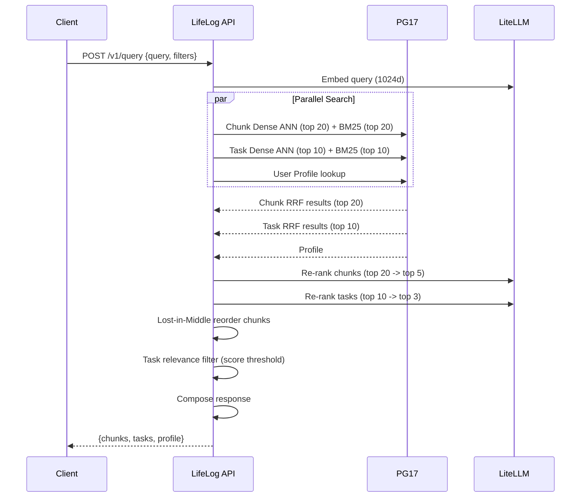
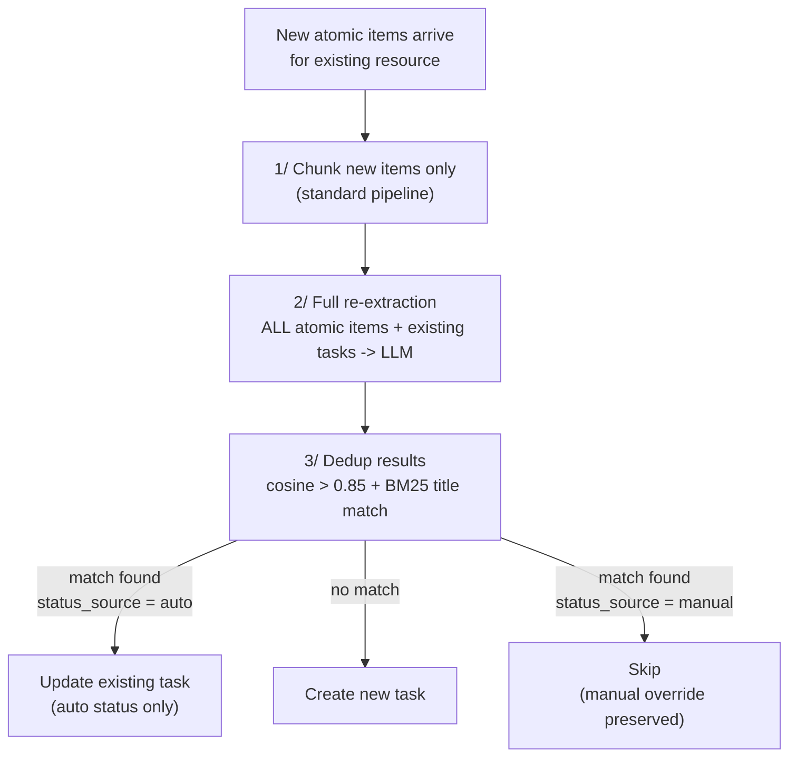

# LifeLog - Architecture Design

> Personal knowledge retrieval system with a standalone API server. Sensors collect raw data from any platform; the API server handles all intelligence (chunking, LLM analysis, embedding, search). All inference runs on Strix Halo homelab via self-hosted models through LiteLLM.

---

## 1. System Overview



### Design Principles

| Principle | How Applied |
|---|---|
| **Platform independence** | Sensors are stateless HTTP clients. Any tool can push to the API |
| **Intelligence centralized** | All LLM calls, chunking, embedding happen in the API server only |
| **Async ingestion** | Sensors fire-and-forget to Redis Streams; workers process at their own pace |
| **Sync retrieval** | Queries are real-time request-response through the API |
| **YAGNI** | Single Go binary, Redis Streams (not Kafka), PG17 (not separate vector DB) |

---

## 2. Deployment Topology



| Component | Host | Port | Image |
|---|---|---|---|
| **lifelog-api** | docker-prod | 8090 | Custom Go binary |
| **postgresql-vectorchord** | docker-prod | 5434 | `ghcr.io/immich-app/postgres:17-vectorchord0.5.3` |
| **redis** | docker-prod | 6379 | `redis:7.4.1-alpine3.20` |
| **litellm** | strix-halo | 4000 | `ghcr.io/berriai/litellm:v1.81.3-stable` |
| **llama-swap** | strix-halo | 8080 | `kyuz0/amd-strix-halo-toolboxes:rocm-6.4.4` |
| **agent-zero** | strix-halo | 50080 | `agent0ai/agent-zero:v1.8` |

### LLM Models via LiteLLM

| Model | Purpose | Native Dim | Used Dim | API |
|---|---|---|---|---|
| Qwen3-Embedding-8B | Embedding (primary) | 4096 | **1024** (MRL truncation) | `llm.gigary.com/v1/embeddings` |
| Qwen3-Embedding-0.6B | Embedding (fallback) | 1024 | **1024** (native) | same |
| Qwen3-Reranker-0.6B | Re-ranking | - | - | `llm.gigary.com/v1/rerank` |
| Qwen3.5-35B | LLM (chunking, extraction) | - | - | `llm.gigary.com/v1/chat/completions` |

**Why 1024d:** All Qwen3-Embedding models (0.6B, 4B, 8B) support 1024d via Matryoshka Representation Learning. This enables model swapping without re-indexing, 4x less storage vs 4096d, and 4x faster ANN. llama.cpp generates full native dims; the API server truncates to first 1024 dims in application code.

---

## 3. API Server Architecture (Clean Architecture)



| Layer | Responsibility | Depends On |
|---|---|---|
| **Handler** | HTTP request/response, validation, auth | Service |
| **Service** | Business logic, orchestration, pipeline coordination | Repository |
| **Repository** | Data access (PG queries, Redis ops, LiteLLM API calls) | External infra |
| **Model** | Domain structs (Resource, AtomicItem, Chunk, Task) | Nothing |

**Dependency rule:** Handler -> Service -> Repository -> Model. No reverse dependencies.

### API Endpoints

| Method | Path | Purpose | Response |
|---|---|---|---|
| `POST` | `/v1/ingest` | Receive raw content from sensors | `202 Accepted` (queued) |
| `POST` | `/v1/query` | Semantic + task hybrid search | `200 OK` (results) |
| `PATCH` | `/v1/tasks/:id` | Update task labels/status | `200 OK` |
| `GET` | `/v1/tasks` | List tasks with filters | `200 OK` |
| `PUT` | `/v1/profile` | Update user profile | `200 OK` |
| `GET` | `/health` | Liveness + dependency checks | `200 OK` |

### Ingest Request

```json
{
  "source": "google_chat",
  "resource_id": "space-abc-thread-123",
  "resource_name": "DPD Leads - April 6 discussion",
  "items": [
    {
      "external_id": "msg-456",
      "author": "Michael Bui",
      "content": "The Datadog latency alert is back...",
      "timestamp": "2026-04-06T10:15:00+08:00",
      "metadata": {"space": "DPD Leads"}
    }
  ]
}
```

---

## 4. Data Model



### Schema: `lifelog`

All tables live in the `lifelog` schema on the PG17 VectorChord instance (port 5434).

**Indexes:**

| Table | Index | Type | Purpose |
|---|---|---|---|
| chunks | `chunks_embedding_idx` | VectorChord HNSW (cosine, 1024d) | Dense ANN search |
| chunks | `chunks_tsv_idx` | GIN | BM25 keyword search |
| chunks | `chunks_resource_id_idx` | B-tree | Filter by resource |
| tasks | `tasks_embedding_idx` | VectorChord HNSW (cosine, 1024d) | Dense ANN search |
| tasks | `tasks_tsv_idx` | GIN | BM25 keyword search |
| tasks | `tasks_status_idx` | B-tree | Filter active tasks |
| tasks | `tasks_labels_idx` | GIN | Filter by labels |
| atomic_items | `atomic_items_content_hash_idx` | B-tree UNIQUE | Dedup on ingest |
| resources | `resources_source_external_id_idx` | B-tree UNIQUE | Dedup resources |

---

## 5. Ingestion Pipeline



### Ingestion Steps (per message from queue)

| Step | Input | Process | Output | LLM? |
|---|---|---|---|---|
| 1. Dedup | content_hash | Check `atomic_items.content_hash` exists | Skip if duplicate | No |
| 2. Persist | raw content | Upsert resource + atomic_items | DB rows | No |
| 3. Semantic chunk | atomic item text | LLM identifies topic boundaries, split at boundaries with min 200 / max 600 tokens, >= 20% overlap | Chunk texts | Yes (free) |
| 4. Contextual retrieval | chunk + resource context | LLM generates 50-100 token context prefix per chunk | Enriched chunks | Yes (free) |
| 5. Embed chunks | enriched chunk text | `Instruct: Given a search query, retrieve relevant passages\nQuery: {text}` -> 1024d vector | Chunk vectors | Yes (free) |
| 6. Store chunks | enriched text + vector | INSERT into `lifelog.chunks` with vector + tsvector | DB rows | No |
| 7. Task extraction | full resource content | LLM extracts tasks with structured fields | Task JSON | Yes (free) |
| 8. Embed tasks | task title + description | Same embedding call -> 1024d | Task vectors | Yes (free) |
| 9. Dedup tasks | new task vs existing | Cosine > 0.85 + BM25 title match -> update; else create | Upserted tasks | No |

### Chunking Strategies by Source

| Source | Strategy | Semantic Chunking | Target | Overlap | Context Header |
|---|---|---|---|---|---|
| Google Chat | Conversation-window (5-10 msgs) | Yes | 400-512 tokens | >= 20% | `[gchat] space: {name} \| author: {name} \| date: {date}` |
| Gmail | Recursive paragraph, strip signatures | Yes (long threads) | 400-512 tokens | >= 20% | `[gmail] subject: {subj} \| from: {from} \| date: {date}` |
| Jira | Structure-aware (desc + each comment) | No (atomic) | 400-512 tokens | None | `[jira] {key}: {summary} \| status: {status}` |
| Agent Zero | Turn-pair (user + assistant) | Yes (long convos) | 400-512 tokens | >= 20% | `[agent_zero] date: {date} \| topic: {inferred}` |
| PDF/DOCX | Page/section-aware | Yes | 400-512 tokens | >= 20% | `[file] name: {file} \| section: {heading}` |

---

## 6. Sensors

Sensors are **thin, stateless scripts** that collect raw data and POST to the LifeLog API. No intelligence, no chunking, no LLM calls.



### Sensor Contract

Every sensor POSTs the same payload format to `POST /v1/ingest`:

```json
{
  "source": "google_chat | gmail | jira | agent_zero | ...",
  "resource_id": "source-specific-unique-id",
  "resource_name": "human-readable name",
  "items": [
    {
      "external_id": "item-unique-id",
      "author": "Person Name",
      "content": "raw text content",
      "timestamp": "ISO8601 with timezone",
      "metadata": {}
    }
  ]
}
```

| Field | Required | Purpose |
|---|---|---|
| `source` | Yes | Identifies which chunking strategy to apply |
| `resource_id` | Yes | Groups atomic items into resources for task extraction |
| `resource_name` | Yes | Human-readable label for the resource |
| `items[].external_id` | Yes | Dedup key (combined with source) |
| `items[].content` | Yes | Raw text - the API server handles all processing |
| `items[].timestamp` | Yes | Original creation time at source |
| `items[].metadata` | No | Source-specific fields (space name, labels, etc.) |

### Sensor Behavior

| Rule | Why |
|---|---|
| Fire-and-forget | Sensor gets `202 Accepted` and moves on. No waiting for processing |
| Idempotent | Re-sending the same `external_id` is safe (dedup via content_hash) |
| No batching required | Can send 1 item or 100 items per request |
| No state | Sensor reads from source API, POSTs to LifeLog, done |
| Auth via API key | Simple `Authorization: Bearer <key>` header |

---

## 7. Scheduling Strategy



### Why Not Agent Zero Scheduled Tasks

Agent Zero Scheduled Tasks run inside the agent's conversation loop - they require LLM inference just to execute a simple script. For sensors that need zero intelligence (just fetch + POST), this wastes GPU time and adds ~5-10s startup latency per invocation.

### Recommended: systemd timers on strix-halo

| Advantage | Detail |
|---|---|
| Zero overhead | No LLM, no Agent Zero boot, no Python interpreter for shell scripts |
| Reliable | systemd handles retries, logging, dependencies |
| Observable | `systemctl status lifelog-*`, `journalctl -u lifelog-*` |
| Flexible | Per-sensor schedules: gchat every 5 min, gmail every 15 min, jira hourly |

### Alternative: n8n Workflows

Already running n8n at `rpa.gigary.com`. Good for sensors that need OAuth flows (Google Chat, Gmail) since n8n has built-in Google integrations.

| Sensor | Scheduler | Frequency | Rationale |
|---|---|---|---|
| Google Chat | n8n (Google Chat node) | Every 5 min | n8n has native Google Workspace integration |
| Gmail | n8n (Gmail node) | Every 15 min | n8n handles OAuth token refresh |
| Jira | systemd timer | Every 1 hour | Simple REST API + API key, no OAuth needed |
| Agent Zero logs | systemd timer | Every 30 min | Reads local SQLite, no network auth |
| PDF/DOCX | systemd timer (inotifywait) | On file change | Watch a directory for new files |

---

## 8. Retrieval Pipeline



### Always-On Dual Search (No Routing)

Every query searches BOTH chunks and tasks in parallel. No routing decision needed.

| Component | Latency | Why |
|---|---|---|
| Task Dense ANN | ~10ms | ~1K tasks vs ~14K chunks |
| Task BM25 | ~5ms | GIN index on small table |
| Task Re-Rank | ~200ms | Only 10 candidates |
| **Total Task Overhead** | **~215ms** | < 5% of total query time |

### Chunk Filters (composable via query params)

| Filter | SQL | Example |
|---|---|---|
| Source | `WHERE c.source = $1` | Only Gmail |
| Time range | `WHERE ai.source_ts BETWEEN $1 AND $2` | Last 7 days |
| Resource | `WHERE c.resource_id = $1` | Specific chat |

### Task Filters (composable via query params)

| Filter | SQL | Example |
|---|---|---|
| Status | `WHERE t.status = $1` | In-progress only |
| Assignee | `WHERE t.assignee = $1` | My tasks |
| Deadline | `WHERE t.deadline <= $1` | Due this week |
| Labels | `WHERE $1 = ANY(t.labels)` | KIV items |
| Priority | `WHERE t.priority = $1` | Critical only |
| Blocked | `WHERE t.status = 'blocked'` | All blockers |

### Result Composition

```
## Relevant Context
[Top 5 chunks with source attribution, lost-in-middle reordered]

## Related Tasks
[Top 3 tasks with status/owner/deadline/labels]
[Omitted if none pass relevance threshold]

## Your Profile
[User profile context - always included]
```

---

## 9. Task Model

### Task Extraction (Resource-Level)

After ingesting a resource's atomic items, pass the **full resource content** to LLM:

```
Analyze this complete resource and extract tasks, action items, or follow-ups.

<resource>
Source: {{SOURCE_TYPE}}
Resource ID: {{RESOURCE_ID}}
{{FULL_RESOURCE_CONTENT}}
</resource>

Return JSON:
{
  "tasks": [
    {
      "title": "1-sentence summary",
      "description": "2-3 sentence context",
      "owner": "person or 'me'",
      "assignee": "person or 'me'",
      "status": "pending | in_progress | blocked | done",
      "deadline": "YYYY-MM-DD or null",
      "priority": "low | medium | high | critical",
      "contribution_type": "decision | delivery | review | discussion | escalation | null",
      "blocked_by": [{"person_or_task": "...", "reason": "..."}]
    }
  ]
}
```

### Task Update Strategy (Full Re-Extraction)

When new atomic content arrives for an existing resource:



| Rule | Detail |
|---|---|
| Full re-extraction over delta-only | LLM sees complete context. Free tokens, offline pipeline |
| Auto-status advances only | pending -> in_progress -> done. Never regresses |
| Manual overrides preserved | `status_source = 'manual'` is never touched by auto-update |
| 1 LLM call per affected resource | Not per chunk. ~1K resources = ~1K calls total |

### User Labels

| Label | Effect |
|---|---|
| `KIV` | Boosted in watchlist queries |
| `important` | Boosted in all task queries |
| `done` | Overrides auto-status, excluded from active queries |
| `irrelevant` | Soft-excluded from task retrieval |
| `follow-up` | Included in follow-up queries |
| Custom | User-defined: `project:lifelog`, `team:payments` |

---

## 10. User Profile (Always-On Context)

Dedicated `source = 'user_profile'` resource for personality, preferences, interests.

| Aspect | Detail |
|---|---|
| Storage | Resource with single atomic item, chunked + embedded like any content |
| Retrieval | Top-1 profile chunk always injected into every query response |
| Updates | `PUT /v1/profile` with new text content |
| Auto-update | Never - user-authored content only |

---

## 11. Techniques Decision Matrix

> With unlimited self-hosted LLM tokens, all ingestion-time LLM calls are effectively free. Optimize for **index quality** over ingestion speed.

### Phase 1 (ADOPT)

| Technique | Impact | LLM Cost |
|---|---|---|
| **Contextual Retrieval** | -49% retrieval failures, -67% with reranking ([Anthropic 2024](https://www.anthropic.com/news/contextual-retrieval)) | 1 call/chunk (free) |
| **Semantic Chunking** | Up to +9% recall ([ScienceDirect 2025](https://www.sciencedirect.com/science/article/pii/S0950705125019343)) | 1 call/doc (free) |
| **Task Extraction** | Enables structured queries pure semantic search cannot answer | 1 call/resource (free) |
| **Hybrid Search** (dense + BM25 + RRF) | +10-30% MRR over vector-only ([NVIDIA 2026](https://developer.nvidia.com/blog/enhancing-rag-pipelines-with-re-ranking/)) | None |
| **Cross-Encoder Re-Ranking** | +15-40% NDCG@10 ([NVIDIA 2026](https://developer.nvidia.com/blog/enhancing-rag-pipelines-with-re-ranking/)) | None (deployed) |
| **Content-Aware Chunking** (>= 20% overlap) | Baseline quality ([Firecrawl 2026](https://www.firecrawl.dev/blog/best-chunking-strategies-rag)) | None |
| **Always-On Dual Search** | Eliminates routing errors at ~215ms overhead ([Techment 2026](https://www.techment.com/blogs/rag-architectures-enterprise-use-cases-2026/)) | None |
| **Lost-in-Middle Reordering** | Several % accuracy gain ([Redis 2026](https://redis.io/blog/10-techniques-to-improve-rag-accuracy/)) | None |
| **Matryoshka 1024d Embeddings** | 4x less storage, model-portable, minimal recall loss | None |

### Phase 2 (EVALUATE after Phase 1 metrics)

| Technique | Trigger | Implementation |
|---|---|---|
| **HyDE** | Recall < 0.7 on ambiguous queries | LLM generates hypothetical answer, embed that |
| **Multi-Query Expansion** | Recall < 0.7 on broad queries | 3-5 query variants, merge via RRF |
| **Reverse HyDE** | Query latency too high | Hypothetical questions at index time |
| **Parent Document Retrieval** | Generation quality low despite good retrieval | Search child chunks, return parent |

### Phase 3+ (DEFER)

| Technique | Why Deferred |
|---|---|
| Late Chunking | Requires token-level embeddings, llama.cpp returns pooled only |
| ColBERT | Multi-vector storage, 10-100x storage cost |
| RAPTOR | Over-engineered for ~5.5K documents |
| Knowledge Graph | Graph DB infrastructure for marginal gains at this scale |
| LLM Query Classification | Extra LLM call per retrieval, always-on dual search sufficient |

---

## 12. Storage Estimates (1024d)

### Assumptions

- 5,500 documents across ~1,000 resources
- ~2.5 chunks per document (13,750 chunks)
- ~30% of resources have extractable tasks (~1,000 tasks)
- Embedding: **1024d x float32 = 4,096 bytes** per vector (was 16,384 at 4096d)
- HNSW overhead: ~1.5x vector storage

### Chunk Storage

| Scale | Chunks | Vectors (HNSW) | BM25 + Text | **Total** |
|---|---|---|---|---|
| **Current** | ~13,750 | 80 MB | 27 MB | **~107 MB** |
| **10x** | ~137,500 | 800 MB | 270 MB | **~1.1 GB** |
| **100x** | ~1,375,000 | 8 GB | 2.7 GB | **~10.7 GB** |

### Task Storage

| Scale | Tasks | Vectors (HNSW) | BM25 + Structured | **Total** |
|---|---|---|---|---|
| **Current** | ~1,000 | 6 MB | 3 MB | **~9 MB** |
| **10x** | ~10,000 | 60 MB | 25 MB | **~85 MB** |
| **100x** | ~100,000 | 600 MB | 250 MB | **~850 MB** |

### Grand Total

| Scale | Chunks | Tasks | Indexes | **Grand Total** |
|---|---|---|---|---|
| **Current (5.5K docs)** | 107 MB | 9 MB | ~10 MB | **~126 MB** |
| **10x (55K docs)** | 1.1 GB | 85 MB | ~100 MB | **~1.3 GB** |
| **100x (550K docs)** | 10.7 GB | 850 MB | ~1 GB | **~12.5 GB** |

**vs 4096d:** Current scale would be ~400 MB at 4096d vs ~126 MB at 1024d. At 100x scale: ~40 GB vs ~12.5 GB. 1024d saves ~68% total storage.

---

## 13. Evaluation Strategy

### Retrieval Metrics

| Metric | Target | When |
|---|---|---|
| Context Precision | >= 0.8 | Phase 3 |
| Context Recall | >= 0.7 | Phase 3 |
| Faithfulness | >= 0.9 | Phase 3 |
| NDCG@5 | >= 0.7 | Phase 3 |
| Latency (end-to-end) | < 5s | Phase 1 |

### Task Metrics

| Metric | Target | When |
|---|---|---|
| Task Extraction Accuracy | >= 0.85 | Phase 1 |
| Task Dedup Accuracy | >= 0.9 | Phase 1 |
| Task Re-Extraction Accuracy | >= 0.85 | Phase 1 |
| Task Relevance Filtering | No false negatives | Phase 3 |

50 test queries: 15 semantic, 15 structured, 10 hybrid, 5 profile, 5 label.

---

## 14. Phases

| Phase | Scope | Status |
|---|---|---|
| **0: Infrastructure** | PG17 VectorChord, embedding + reranker models, LiteLLM | **COMPLETE** |
| **1: Foundation** | LifeLog API server (Go), schema, ingestion workers, first sensor (Agent Zero logs) | **DESIGN PHASE** |
| **2: Sensors** | Google Chat, Gmail, Jira sensors + scheduling (systemd/n8n) | Pending Phase 1 |
| **3: Agent Integration** | Agent Zero search tool, task labeling, user profile | Pending Phase 2 |
| **4: Quality Tuning** | Evaluate on 50 test queries, tune pipeline, Phase 2 techniques | Pending Phase 3 |
| **5: Expansion** | Confluence, PDF/DOCX, Cursor MCP, daily digest | Pending Phase 4 |

---

## 15. References

| Claim | Source |
|---|---|
| Contextual Retrieval: -49% failures, -67% with reranking | [Anthropic Sep 2024](https://www.anthropic.com/news/contextual-retrieval) |
| Semantic chunking: up to +9% recall | [ScienceDirect 2025](https://www.sciencedirect.com/science/article/pii/S0950705125019343) |
| Hybrid search: +10-30% MRR | [NVIDIA RAG Blog 2026](https://developer.nvidia.com/blog/enhancing-rag-pipelines-with-re-ranking/) |
| Re-ranking: +15-40% NDCG@10 | [NVIDIA RAG Blog 2026](https://developer.nvidia.com/blog/enhancing-rag-pipelines-with-re-ranking/) |
| Chunk size 400-512 tokens, 10-20% overlap | [Firecrawl 2026](https://www.firecrawl.dev/blog/best-chunking-strategies-rag) |
| Lost-in-middle: LLM U-shaped attention curve | [Redis RAG Guide 2026](https://redis.io/blog/10-techniques-to-improve-rag-accuracy/) |
| RAG quality is indexing problem | [Techment 2026](https://www.techment.com/blogs/rag-architectures-enterprise-use-cases-2026/) |
| Always-on dual search eliminates routing errors | [ScienceDirect Query-Adaptive RAG 2026](https://www.sciencedirect.com/science/article/pii/S0278612526001020) |
| Late chunking requires token-level embeddings | [Jina AI 2024](https://jina.ai/news/late-chunking-in-long-context-embedding-models/) |
| Qwen3-Embedding supports Matryoshka (MRL) | [HuggingFace](https://huggingface.co/Qwen/Qwen3-Embedding-0.6B) |
| Qwen3-Embedding-8B GGUF | [HuggingFace](https://huggingface.co/Qwen/Qwen3-Embedding-8B-GGUF) |
