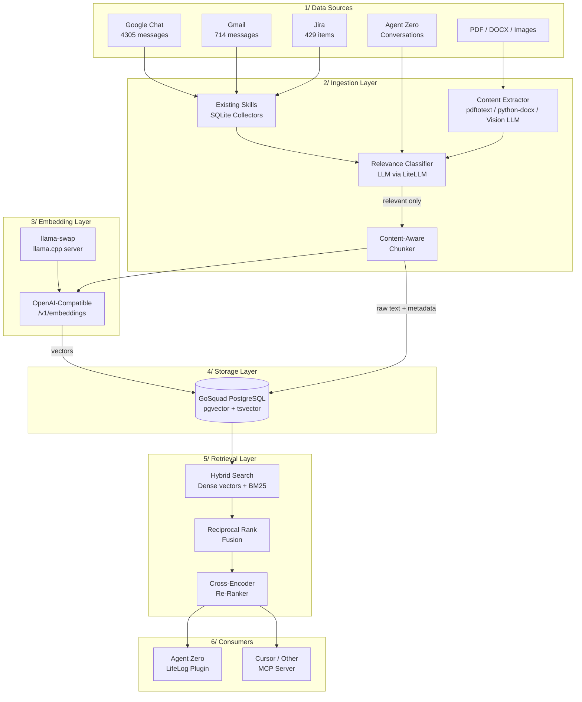
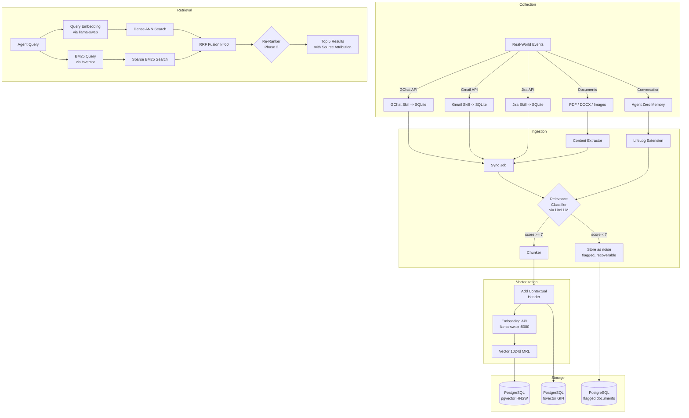

# LifeLog - Unified Context Architecture

> Personal knowledge system that captures, classifies, vectorizes, and retrieves context from daily professional life.

---

## 1. Problem Statement

Context from daily work arrives in isolated silos - Google Chat alerts, Gmail threads, Jira tickets. Each lives in its own SQLite database with no cross-referencing, no semantic search, and no way for an AI agent to holistically understand "what happened this week." The Agent Zero memory system captures everything indiscriminately, including test conversations and noise that pollutes the knowledge base.

**Goal:** A unified, searchable knowledge system that only retains professionally relevant context and makes it available to AI agents through semantic search.

---

## 2. Homelab Infrastructure (As-Is)

| Component | Host | Tech | Endpoint |
|---|---|---|---|
| Strix Halo AI Server | 192.168.1.4 | AMD gfx1151, ROCm 6.4.4, 128GB RAM, Podman | - |
| llama-swap + llama.cpp | 192.168.1.4 | `kyuz0/amd-strix-halo-toolboxes:rocm-6.4.4` | `:8080` |
| LiteLLM Gateway | 192.168.1.4 | `ghcr.io/berriai/litellm:v1.81.3-stable` | `:4000` |
| Agent Zero v1.8 | 192.168.1.4 | `agent0ai/agent-zero:v1.8`, NFS from TrueNAS | `:50080` |
| GoSquad PostgreSQL | 192.168.1.11 | `tensorchord/pgvecto-rs:pg15-v0.2.1` (docker-prod VM) | `:5432` |
| TrueNAS (NFS storage) | 192.168.1.10 | NFS v4 | User data at `/mnt/main/Home/Apps/AgentZero/usr` |

**Key constraints:**
- All inference runs through llama-swap / llama.cpp, NOT vLLM. Any embedding model must be available in GGUF format.
- PostgreSQL currently uses pgvecto.rs (deprecated). Migration to VectorChord planned (see KDD-009).
- Services on same PostgreSQL: Immich (20yr family photos), n8n, LiteLLM.

---

## 3. Architecture Overview



---

## 4. Design Decisions

### KDD-001: Embedding Model Selection

**Decision:** **Qwen3-Embedding-8B** (GGUF Q8_0) as primary model, with Qwen3-Embedding-0.6B as batch/fallback.

**Selection rubric** (100 points, applied against MTEB Leaderboard CSV - 401 models, April 2026):

| Criterion | Weight | Why |
|---|---|---|
| Retrieval Quality (MTEB Retrieval score) | 25 | Core use case is semantic search |
| GGUF/llama.cpp Compatibility | 20 | Must run on Strix Halo via llama-swap |
| Overall Quality (MTEB Mean) | 15 | General embedding quality |
| Memory Footprint (fits 128GB shared) | 10 | Coexist with LLM workloads |
| Matryoshka (MRL) support | 10 | Flexible dims = storage savings |
| Context Window | 5 | Long email threads, Jira descriptions |
| Multilingual | 5 | English primary, some Vietnamese |
| Instruction-following | 5 | Different prompts for query vs document |
| Multimodal | 5 | Nice-to-have for future path |

**Scored results** (top candidates from MTEB CSV):

| Model | Retrieval (25) | GGUF (20) | Mean (15) | Memory (10) | MRL (10) | Other (15) | **Total** |
|---|---|---|---|---|---|---|---|
| **Qwen3-Embedding-8B** | 23 (70.88) | **20** | 14 (70.58) | 7 (~16GB Q8) | **10** | 15 | **89** |
| Qwen3-Embedding-4B | 22 (69.60) | **20** | 13 (69.45) | 8 (~8GB) | **10** | 15 | **88** |
| Qwen3-Embedding-0.6B | 20 (64.65) | **20** | 11 (64.34) | **10** (~1.2GB) | **10** | 15 | **86** |
| KaLM-Gemma3-12B | 24 (75.66) | 18 (community) | **15** (72.32) | 5 (~24GB) | 0 | 15 | **77** |
| harrier-oss-v1-0.6b | 23 (70.75) | 16 (community) | 13 (69.01) | **10** | 0 | 13 | **75** |

**Eliminated:** llama-embed-nemotron-8b (LlamaBidirectionalModel arch unsupported in llama.cpp), harrier-oss-v1-27b (no GGUF, 80GB+ VRAM required).

**Why Qwen3-Embedding-8B wins:**
- Official GGUF from Qwen on HuggingFace (not community-converted)
- Matryoshka (MRL): truncate 4096d -> 1024d -> 512d without re-embedding
- 100+ language support (English + Vietnamese for family content)
- Instruction-following: separate prompts for query vs document
- Top retrieval score (70.88) among all GGUF-compatible models
- 32K token context window

**Tiered deployment:**

| Tier | Model | Use Case | VRAM |
|---|---|---|---|
| Primary | Qwen3-Embedding-8B (Q8_0) | Retrieval queries, high-quality ingestion | ~16GB |
| Fallback | Qwen3-Embedding-0.6B (F16) | Bulk batch ingestion, low-resource | ~1.2GB |

**Source:** MTEB Leaderboard CSV (April 2026, `tmp0mfmx6jf.csv`, 401 models)

### KDD-002: Embedding API Layer

**Decision:** llama-swap + llama.cpp `--embedding` mode, proxied through LiteLLM.

**Rationale:**
- Already deployed and proven on Strix Halo
- llama.cpp flags: `--embedding --pooling last --embd-normalize -1`
- OpenAI-compatible `/v1/embeddings` API
- LiteLLM proxy provides unified API for all consumers
- Model swapping via llama-swap config - zero downtime when upgrading
- Decoupled from Agent Zero: embedding service survives platform changes

### KDD-003: Hybrid Search (Dense Vectors + BM25)

**Decision:** Two-signal hybrid retrieval using pgvector (dense) + PostgreSQL tsvector (BM25 sparse), fused via Reciprocal Rank Fusion (RRF).

**Why hybrid and not vector-only:**
- Dense vector search excels at **semantic intent** ("what were the recent performance issues?")
- BM25 sparse search excels at **exact matches** ("DPD-383", "BCRS deposit", specific names)
- Our data is heavily mixed: Datadog alert keywords, Jira ticket IDs, people names, technical terms
- Industry benchmarks show hybrid search improves MRR by 10-30% over vector-only
- pgvector + tsvector both live in the same PostgreSQL instance - no extra infrastructure
- tsvector is a **built-in PostgreSQL feature** (all PG15+ versions) - zero extensions needed

**Fusion method:** Reciprocal Rank Fusion (RRF) with k=60. Parameter-free and robust.

### KDD-004: Re-Ranking

**Decision:** Include as optional Phase 2 component.

- Cross-encoder improves NDCG@10 by 15-40% in benchmarks
- Adds 2-5 seconds latency per query (within our 10-30s budget)
- Recommended model: `cross-encoder/ms-marco-MiniLM-L-12-v2`
- Enable when retrieval quality (NDCG@10 on 50 test queries) falls below 0.7

### KDD-005: Relevance Classifier

**Decision:** LLM-based classification at ingestion time via LiteLLM gateway.

**Classification criteria:**
- **Relevant (7-10):** Work discussions, decisions, action items, technical alerts, project updates, code reviews, professional emails, Jira activity, knowledge worth recalling
- **Noise (0-6):** Casual greetings, automated bot notifications, test/debug AI conversations, spam/marketing, repetitive Datadog trigger/recover cycles (< 5 min)

Noise documents stored but flagged (recoverable if classifier improves).

### KDD-006: Chunking Strategy

**Decision:** Content-type-aware chunking with contextual headers.

| Content Type | Strategy | Target Size | Overlap |
|---|---|---|---|
| Chat messages | Conversation-window (5-10 msgs) | 512 tokens | 50 tokens |
| Emails | Recursive paragraph, strip signatures | 512 tokens | 64 tokens |
| Jira tickets | Structure-aware (description + each comment) | 512 tokens | None (atomic) |
| Agent Zero | Turn-pair (user + assistant) | 512 tokens | 50 tokens |
| PDF/DOCX | Page-level or semantic splitting | 512 tokens | 64 tokens |

**Contextual header** per chunk (improves retrieval by 10-15% per Anthropic research):

```
[gchat] space: DPD Leads | author: Nikhil Grover | date: 2026-04-06
```

### KDD-007: Agent Zero Integration

**Decision:** Custom `lifelog` plugin with search tool and memory filter override.

**Plugin responsibilities:**
1. **LifeLog Search Tool** - Hybrid search query to PostgreSQL
2. **Memory Filter Override** - Custom `memory.memories_filter.sys.md` excludes noise
3. **Memorize Extension** - `monologue_end` hook runs relevance classifier before storage

**Agent Zero independence:** Plugin is a thin API wrapper. All heavy lifting in external services.

### KDD-008: Multimodal Content Strategy

**Decision:** "Extract Then Embed" pipeline. True multimodal embedding in llama.cpp is NOT production-ready (April 2026).

| Content Type | Extraction Method | Then |
|---|---|---|
| PDF | `pdftotext` / `pymupdf`, OCR via Tesseract for scans | Text -> Qwen3-Embedding |
| DOCX | `python-docx` / Pandoc | Text -> Qwen3-Embedding |
| Images | Vision LLM caption via LiteLLM | Caption text -> Qwen3-Embedding |

**Why not native multimodal embedding:**
- Qwen3-VL-Embedding GGUF: only experimental community conversions, pooling errors
- Jina v5: text-only (v4 multimodal requires a llama.cpp fork)
- Upstream llama.cpp has no merged multimodal embedding support

**Future path:** When llama.cpp merges stable multimodal embedding (tracking Qwen3-VL-Embedding PR), add native vision embedding alongside text extraction.

### KDD-009: PostgreSQL Strategy

**Current:** `tensorchord/pgvecto-rs:pg15-v0.2.1` (pgvecto.rs - DEPRECATED)
**Target:** VectorChord + pgvector on PG17

**Context:** Immich has officially migrated to VectorChord. pgvecto.rs support will be dropped. The same PostgreSQL hosts Immich (20yr family photos), n8n, and LiteLLM.

**Migration plan (Two-Phase, "New Instance First"):**

| Phase | Change | Safety |
|---|---|---|
| Phase 1 | New PG15 + VectorChord container (port 5433) alongside old (5432) | Old untouched, instant rollback via port swap |
| Phase 2 | New PG17 + VectorChord container (port 5434), dump/restore from Phase 1 | Phase 1 untouched, instant rollback |

**LifeLog strategy:** Uses standard pgvector API (`vector()` type, `<=>` cosine) in its own `lifelog` schema. VectorChord (Immich) and pgvector (LifeLog) coexist on same types.

Detailed migration plan: `Cursor-Immich.md`

---

## 5. Data Flow



### Sync Schedule

| Source | Frequency | Method |
|---|---|---|
| Google Chat | Every 15 min | Existing skill -> SQLite; Sync job -> PostgreSQL |
| Gmail | Every 15 min | Same pattern |
| Jira | Every 30 min | Same pattern |
| Agent Zero | Real-time | monologue_end hook |
| PDF/DOCX/Images | On-demand | Manual upload or watched directory |

---

## 6. Storage Design (High-Level)

**Schema: `lifelog`** in GoSquad PostgreSQL (192.168.1.11:5432)

### Tables

| Table | Purpose | Key Columns |
|---|---|---|
| `documents` | Raw ingested content from all sources | source, resource_id, item_id, author, content, created_at, is_relevant, relevance_score |
| `chunks` | Chunked + embedded content for search | document_id (FK), chunk_index, content, embedding (vector), fts (tsvector) |
| `resource_summaries` | Resource-level summaries with relevance | resource_id, source, title, summary, relevance |

### Indexes

| Index Type | On | Purpose |
|---|---|---|
| HNSW (pgvector) | `chunks.embedding` | Fast approximate nearest-neighbor dense search |
| GIN (tsvector) | `chunks.fts` | BM25-style sparse keyword search |
| B-tree | `documents.source`, `documents.created_at` | Pre-filtering by source and time range |
| Partial B-tree | `documents.is_relevant WHERE TRUE` | Skip noise documents in retrieval |

### Vector Dimensions

Start at 1024d (MRL-truncated from 4096d native). Matryoshka support means further truncation to 512d or 256d without re-indexing.

---

## 7. Future-Proofing

### Model Swapping (Zero Code Changes)

Update llama-swap config to point to new GGUF - all consumers use the same `/v1/embeddings` endpoint.

### Agent Zero Independence

If Agent Zero development stops:
- PostgreSQL data survives in GoSquad DB
- Embedding API survives as standalone llama-swap/llama.cpp instance
- Sync job survives as standalone Python script
- Only the plugin wrapper is Agent Zero-specific (thin, replaceable)

### Expansion Path

| Current | Next |
|---|---|
| 3 text sources (Chat, Mail, Jira) | + Confluence, Slack, Calendar |
| Qwen3-Embedding-0.6B (fallback) | Already have 8B as primary |
| 1024d vectors (MRL-truncated) | Matryoshka to 512d if storage constrained |
| Re-ranking off | Enable cross-encoder when quality needs improve |
| "Extract then Embed" for images | Native multimodal when llama.cpp matures |
| Agent Zero only consumer | + Cursor MCP server, personal dashboard |

---

## 8. Phases

| Phase | Scope | Depends On |
|---|---|---|
| **0: Database** | Migrate PostgreSQL: pgvecto.rs -> VectorChord, PG15 -> PG17 | Manual backup, TrueNAS NFS datasets |
| **1: Foundation** | Deploy Qwen3-Embedding in llama-swap, create PostgreSQL schema, build sync job, backfill data | Phase 0 complete, GGUF model download |
| **2: Agent Integration** | Build LifeLog plugin for Agent Zero, search tool, memory filter override | Phase 1 complete |
| **3: Quality Tuning** | Evaluate retrieval on 50 test queries, tune classifier, decide on re-ranking | Phase 2 complete |
| **4: Expansion** | Add Confluence source, Cursor MCP server, PDF/DOCX/image ingestion, daily digest | Phase 3 stable |

---

## Appendix: References

| Claim | Source | Date |
|---|---|---|
| MTEB model scores (401 models) | MTEB Leaderboard CSV (`tmp0mfmx6jf.csv`) | April 2026 |
| Qwen3-Embedding-8B official GGUF | [HuggingFace Qwen/Qwen3-Embedding-8B-GGUF](https://huggingface.co/Qwen/Qwen3-Embedding-8B-GGUF) | 2026 |
| Qwen3-Embedding MRL support | [Milvus AI Reference](https://milvus.io/ai-quick-reference/what-is-matryoshka-representation-learning-in-qwen3) | 2026 |
| Immich pgvecto.rs deprecation | [Immich Docs - Pre-existing Postgres](https://docs.immich.app/administration/postgres-standalone) | 2026 |
| VectorChord uses pgvector types | [VectorChord GitHub](https://github.com/tensorchord/VectorChord) | 2026 |
| llama-embed-nemotron-8b unsupported arch | [llama.cpp Issue #17478](https://github.com/ggml-org/llama.cpp/issues/17478) | 2025 |
| harrier-oss-v1 no MRL | [Microsoft HuggingFace](https://huggingface.co/microsoft/harrier-oss-v1-0.6b) | 2026 |
| Hybrid search improves MRR by 10-30% | [NVIDIA RAG Blog](https://developer.nvidia.com/blog/enhancing-rag-pipelines-with-re-ranking/) | 2026 |
| Re-ranking improves NDCG@10 by 15-40% | [NVIDIA RAG Blog](https://developer.nvidia.com/blog/enhancing-rag-pipelines-with-re-ranking/) | 2026 |
| Contextual headers improve retrieval by 10-15% | Anthropic contextual retrieval research | 2024 |
| tsvector built-in PG15+ | PostgreSQL documentation | N/A |
| Qwen3-VL-Embedding GGUF experimental | [llama.cpp Discussion #19516](https://github.com/ggml-org/llama.cpp/discussions/19516) | 2026 |
