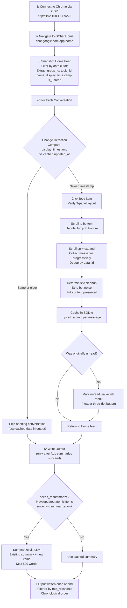
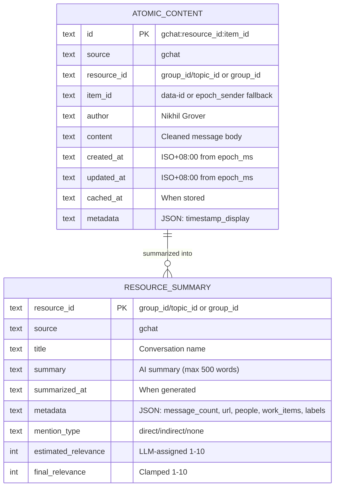
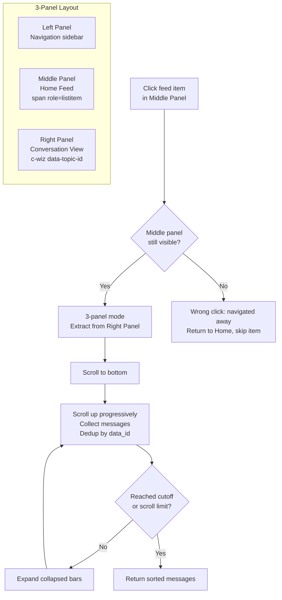

# GChat Skill - Architecture

> Single-file skill (`gchat.py`) with SQLite caching, incremental fetching, and AI summarization.
> Follows the same architecture as `gmail.py` - thread-safe DB, async pipeline, kebab menu unread restoration.

## High-Level Flow



### Early Stop

Configurable via `--early-stop N` (default: 3, 0=disabled). When N consecutive conversations are found unchanged (timestamp match), fetching stops but feed scan continues. All remaining conversations are treated as unchanged and included in the output using cached data.

## Data Available in Home Feed (Without Opening Conversation)

| Field | DOM Source | Example | Notes |
|---|---|---|---|
| `data-group-id` | `span[role="listitem"][data-group-id]` | `dm/abc123` or `space/xyz789` | Group/space ID |
| `data-display-timestamp` | Same element | `1710513600000` (epoch_ms) | Last activity timestamp |
| `data-topic-id` | Same element | `topic_id_string` | Thread/topic ID |
| `data-is-unread` | Same element | `true`/`false` | Unread indicator |
| name | `div.Vb5pDe` text nodes | `Nikhil Grover` | Conversation name |

## Data Available Inside Conversation (After Clicking)

| Field | DOM Source | Notes |
|---|---|---|
| `data-topic-id` | `c-wiz[data-topic-id]` | Thread container |
| `data-id` | `div[role="group"][data-id]` | Per-message ID (our `item_id`) |
| sender | `span[data-member-id][data-name]` | Message author name |
| timestamp display | `span.FvYVyf` | Human-readable time |
| epoch_ms | `span[data-absolute-timestamp]` | Epoch milliseconds (UTC) |
| body | Text walker on `div[role="group"]` | Extracted via TreeWalker |

## ID Conventions

| Concept | Value | Example |
|---|---|---|
| `resource_id` | `{group_id}/{topic_id}` if topic_id present, else `{group_id}` | `space/xyz789/kW7nZX6VF3k` or `dm/abc123` |
| `item_id` | `data-id` or `{epoch_ms}_{sender_hash}` | `message_id_123` |
| Composite PK | `gchat:{resource_id}:{item_id}` | `gchat:space/xyz789/kW7nZX6VF3k:msg123` |

## Data Model



## Timezone Handling

All `epoch_ms` values from GChat DOM are UTC. They are converted to `Asia/Singapore` (UTC+8) ISO format for storage:

```python
_TZ = ZoneInfo("Asia/Singapore")
ts_iso = datetime.fromtimestamp(epoch_ms / 1000, tz=_TZ).isoformat()
# e.g., 2026-04-06T16:10:05.678000+08:00
```

## Unread Status Restoration

The skill tracks which conversations were unread before fetching and attempts to restore that status after reading messages:

1. `snapshot_feed` captures `data-is-unread="true"` from feed items
2. After fetching messages (while conversation is still open), clicks the kebab menu (three-dot button `aria-label="More actions"`) in the conversation header
3. Selects "Mark as unread" from the dropdown menu
4. Falls back gracefully with a WARN log if the menu item isn't found

## Mention Type Detection

| Type | Criteria |
|---|---|
| `direct` | User is the author of any message, or user's name/email appears in message content |
| `indirect` | User is mentioned by name but not as author |
| `none` | No user involvement detected |

## Relevance Scoring

The LLM classifies each conversation into tiers with hard score caps:

| Tier | Examples | Score Range |
|---|---|---|
| PERSONAL | DMs, direct @mentions, personal discussions | 7-10 |
| ACTION-REQUIRED | Access requests, approval requests, calendar invites | 6-8 |
| INFORMATIONAL | Automated alerts, monitoring, reports | 5-7 |

Additional rules:
- `mention_type=direct` floors score at 5
- `mention_type=indirect` floors score at 3
- Automated/bot content capped at 7
- All scores clamped to 1-10

## Thread Safety

- Single `SkillDB` instance shared across threads
- `threading.Lock` acquired inside `_retry()` method for all DB operations
- Async summarization via `_Pipeline` class with worker threads and error collection
- `check_same_thread=False` for SQLite connection (multi-thread access)
- `PRAGMA journal_mode=DELETE` for NFS compatibility

## Data Accuracy & Integrity

### Built-in Safeguards

1. **Composite PK** (`gchat:{resource_id}:{item_id}`) prevents cross-conversation collisions
2. **Immutable inserts** - `upsert_atomic` returns False if PK exists (no accidental overwrites)
3. **Schema migration** - `_migrate_schema` adds columns dynamically without data loss
4. **Lock isolation** - all DB writes go through `_retry` with lock, preventing race conditions
5. **Output-last** - `write_output` called once after ALL summarization completes

### Verification Queries

```sql
-- Orphan summaries (should be 0)
SELECT COUNT(*) FROM resource_summary rs
WHERE rs.source='gchat'
AND rs.resource_id NOT IN (SELECT DISTINCT resource_id FROM atomic_content WHERE source='gchat');

-- Message count consistency
SELECT rs.resource_id, json_extract(rs.metadata, '$.message_count') AS meta_count,
       (SELECT COUNT(*) FROM atomic_content ac WHERE ac.resource_id = rs.resource_id AND ac.source='gchat') AS actual
FROM resource_summary rs WHERE rs.source='gchat';

-- Timezone check (all should have +08:00)
SELECT COUNT(*) FROM atomic_content WHERE source='gchat' AND created_at NOT LIKE '%+08:00';
```

## GChat DOM Navigation (3-Panel Layout)



## Arguments

| Argument | Default | Description |
|---|---|---|
| `--cdp-url` | `http://192.168.1.11:9223` | Chrome DevTools Protocol endpoint |
| `--days` | `3` | Days to look back |
| `--max-threads` | `200` | Max conversations to process |
| `--max-scan` | `500` | Max feed items to scan |
| `--max-scroll` | `5` | Max scroll-up iterations per conversation |
| `--max-expansion` | `5` | Max expansion rounds for collapsed messages |
| `--early-stop` | `3` | Stop fetching after N consecutive unchanged convos (0=disabled) |
| `--focus-title` | *(none)* | Substring filter for conversation titles |
| `--cached-only` | `false` | Output cached summaries without browser |
| `--force` | `false` | Re-fetch and re-summarize all |
| `--debug-dom` | `false` | Dump Home feed DOM to stderr and exit |
| `--output` | `workdir/gchat-output.md` | Output file path |
| `--min-relevance` | `7` | Minimum relevance score for output |

## Environment Variables

| Variable | Required | Default | Purpose |
|---|---|---|---|
| `API_KEY_OTHER` / `LLAMA_TOKEN` | Yes | - | LiteLLM proxy auth |
| `LITELLM_BASE_URL` | No | `https://llm.gigary.com/v1` | LiteLLM proxy endpoint |
| `SUMMARIZE_MODEL` | No | `local/qwen3.5-35b-a3b:instruct-reasoning` | LLM model |
| `MAX_SUMMARY_WORDS` | No | `500` | Max words per summary |

## Key Differences from Gmail Skill

| Aspect | Gmail | GChat |
|---|---|---|
| Resource ID | `data-legacy-thread-id` (hex) | `data-group-id` (path like `dm/abc`) |
| Item ID | `data-legacy-message-id` (hex) | `data-id` or epoch+sender fallback |
| Content mutability | Immutable (emails never change) | Mutable (edit detection skipped in v1) |
| Change detection | `last-non-draft-message-id` comparison | `display_timestamp` comparison |
| Pagination | URL-based `/pN` across search pages | Feed scroll (single-page virtual list) |
| Layout | Single-pane thread view | 3-panel (nav, feed, conversation) |
| Message loading | All visible after expand | Virtual scrolling (progressive) |
| Unread restoration | `Shift+U` keyboard shortcut | Kebab menu "Mark as unread" |
| Timestamp source | DOM text (locale-dependent parsing) | `data-absolute-timestamp` (epoch_ms UTC) |
