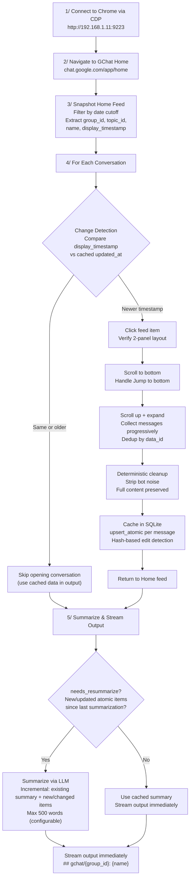
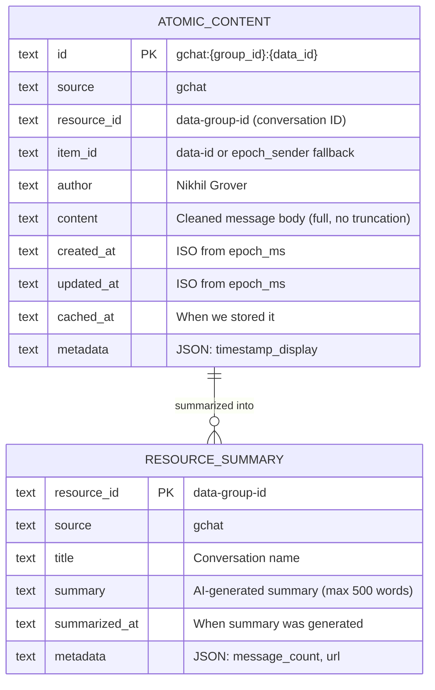
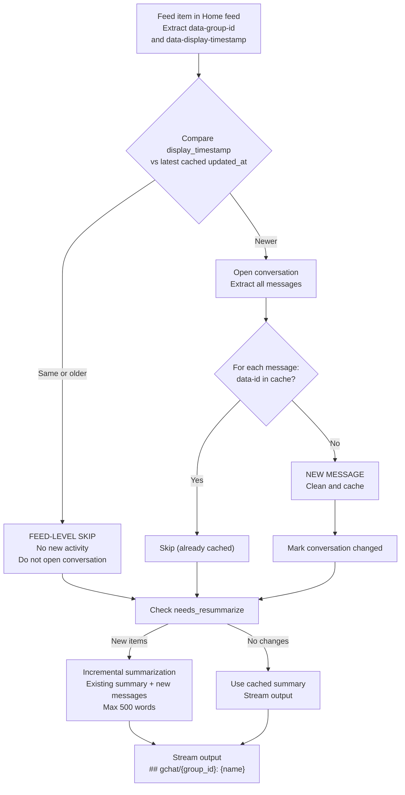
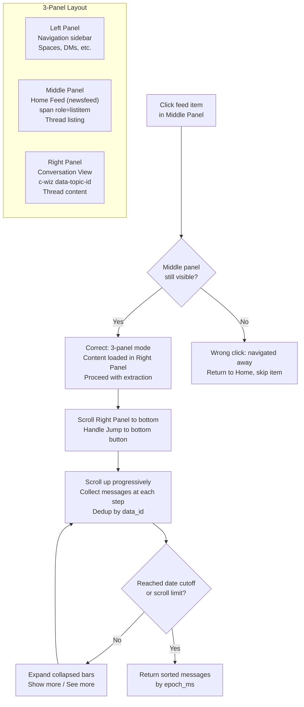
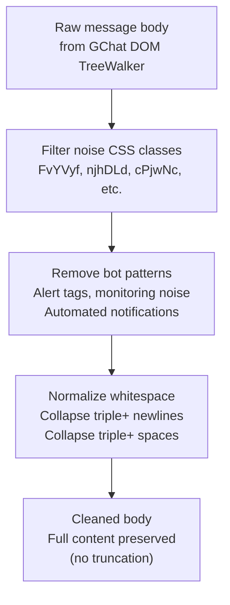
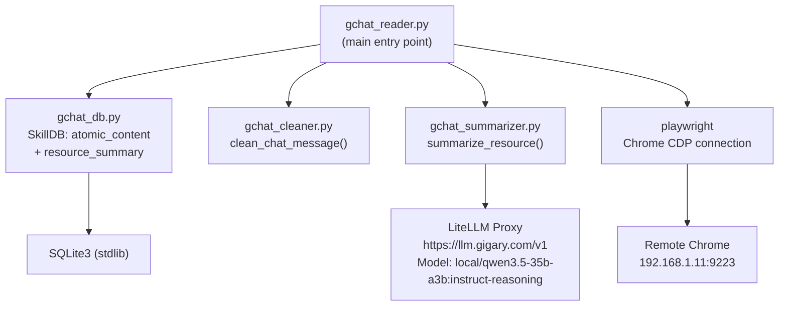

# GChat Skill - Architecture

> Replaces `gchat-thread-reader`. Self-contained with SQLite caching, incremental fetching, and AI summarization.
> All dependencies (DB, cleaner, summarizer) are embedded in `scripts/`.

## High-Level Flow



### Early Stop

Configurable via `--early-stop N` (default: 5, 0=disabled). When N consecutive conversations are found unchanged (timestamp match), scanning stops early. This significantly speeds up subsequent runs.

## Data Available in Home Feed (Without Opening Conversation)

| Field | DOM Source | Example | Notes |
|---|---|---|---|
| `data-group-id` | `span[role="listitem"][data-group-id]` | `dm/abc123` or `space/xyz789` | **Stable conversation ID** - our `resource_id` |
| `data-display-timestamp` | Same element | `1710513600000` (epoch_ms) | **Last activity timestamp** - for change detection |
| `data-topic-id` | Same element | `topic_id_string` | Thread/topic ID within conversation |
| `data-is-unread` | Same element | `true`/`false` | Unread indicator |
| name | `div.Vb5pDe` text nodes | `Nikhil Grover` | Conversation/person name |

## Data Available Inside Conversation (After Clicking)

| Field | DOM Source | Notes |
|---|---|---|
| `data-topic-id` | `c-wiz[data-topic-id]` | Thread container |
| `data-id` | `div[role="group"][data-id]` | **Per-message ID** - our `item_id` |
| sender | `span[data-member-id][data-name]` | Message author name |
| timestamp display | `span.FvYVyf` | Human-readable time |
| epoch_ms | `span[data-absolute-timestamp]` | Epoch milliseconds |
| body | Text walker on `div[role="group"]` | Extracted via TreeWalker, noise classes filtered |

## ID Conventions

| Concept | Value | Example |
|---|---|---|
| `resource_id` | `data-group-id` | `dm/abc123` or `space/xyz789` |
| `item_id` | `data-id` or `{epoch_ms}_{sender_hash}` | `message_id_123` or `1710513600000_42` |
| Change detection key | `data-display-timestamp` (epoch_ms) | `1710513600000` |
| Composite key | `gchat:{resource_id}:{item_id}` | `gchat:dm/abc123:message_id_123` |

## Data Model



## Change Detection Flow

Change detection uses the `data-display-timestamp` from the feed to determine if a conversation has new activity since last cache:



Note: GChat messages can technically be edited after sending, but edit detection is **not implemented** in v1. Messages are treated as insert-only (like Gmail). If a conversation's `display_timestamp` increases, all messages are extracted and new ones are cached.

## GChat DOM Navigation (3-Panel Layout)



## Progressive Message Collection

GChat uses **virtual scrolling** - only messages near the viewport exist in the DOM at any time. Messages are collected progressively by scrolling and deduplicating:

1. Scroll to bottom of conversation
2. Extract all visible messages, dedup by `data_id`
3. Scroll up 800px, extract again, dedup
4. Repeat until date cutoff reached or scroll limit hit
5. Expand any collapsed message bars, extract again
6. Return all collected messages sorted by `epoch_ms`

## Deterministic Cleanup Pipeline



## Output Format

Each conversation is streamed to stdout immediately when its summary is ready:

```
## gchat/dm/abc123: Nikhil Grover
Source: gchat | Group: dm/abc123 | Messages: 20 | Last Activity: 2026-03-15T12:30:00+00:00
[AI-generated summary - participants, key decisions, action items, max 500 words]
```

- Each block streamed with `print(..., flush=True)`
- Use `PYTHONUNBUFFERED=1 python3 -u` for real-time streaming to file
- Progress and diagnostics go to stderr
- No `---` separators (saves tokens)

## File Structure

```
gchat/
├── SKILL.md                  # Agent-facing documentation
├── _architecture.md          # This file (human-facing design)
├── data/
│   ├── .gitignore            # Excludes *.db from git
│   └── gchat_cache.db        # SQLite (auto-created at runtime)
└── scripts/
    ├── gchat_reader.py       # Main script: CDP + feed + caching + output
    ├── gchat_db.py           # Self-contained SQLite DB management
    ├── gchat_cleaner.py      # Self-contained chat message cleanup
    └── gchat_summarizer.py   # Self-contained LLM summarization via LiteLLM
```

## Module Dependencies



## Arguments

| Argument | Default | Description |
|---|---|---|
| `--cdp-url` | `http://192.168.1.11:9223` | Chrome DevTools Protocol endpoint |
| `--days` | `7` | Days to look back |
| `--max-threads` | `50` | Max conversations to process |
| `--max-scan` | `100` | Max feed items to scan (safety cap) |
| `--max-scroll` | `20` | Max scroll-up iterations per conversation |
| `--max-expansion` | `5` | Max expansion rounds for collapsed messages |
| `--early-stop` | `5` | Stop after N consecutive unchanged conversations (0=disabled) |
| `--focus-title` | *(none)* | Substring filter for conversation titles |
| `--force` | `false` | Bypass change detection, re-fetch and re-summarize all |
| `--debug-dom` | `false` | Dump Home feed DOM to stderr and exit |

## Metadata Captured

| Field | Source | Stored In |
|---|---|---|
| group_id (resource_id) | `data-group-id` from feed | All tables |
| display_timestamp | `data-display-timestamp` from feed | Change detection |
| data_id (item_id) | `data-id` from message `div[role="group"]` | atomic_content |
| sender | `span[data-member-id][data-name]` | atomic_content author |
| timestamp | `span.FvYVyf` display text | atomic metadata |
| epoch_ms | `span[data-absolute-timestamp]` | atomic created_at/updated_at |
| conversation name | `div.Vb5pDe` text nodes | resource_summary title |

## Environment Variables

| Variable | Required | Default | Purpose |
|---|---|---|---|
| `API_KEY_OTHER` / `LLAMA_TOKEN` | Yes | - | LiteLLM proxy auth (set via Terraform, or LLAMA_TOKEN) |
| `LITELLM_BASE_URL` | No | `https://llm.gigary.com/v1` | LiteLLM proxy endpoint |
| `SUMMARIZE_MODEL` | No | `local/qwen3.5-35b-a3b:instruct-reasoning` | LLM model for summarization |
| `MAX_SUMMARY_WORDS` | No | `500` | Max words per summary (in prompt) |

## Token Reduction Estimates

| Stage | Input | Output | Reduction |
|---|---|---|---|
| Raw GChat extraction (50 convos, 7 days) | ~500KB (~125K tokens) | - | - |
| Layer 1: Deterministic cleanup | 125K tokens | ~60K tokens | ~50% |
| Layer 2: Skip unchanged convos (re-run) | 60K tokens | 0 (cached) | 100% |
| Layer 3: AI summarization | 60K tokens | ~25K tokens (50 x 500 words) | ~60% |
| **Total (first run)** | **~125K tokens** | **~25K tokens** | **~80%** |
| **Total (re-run, no changes)** | **~125K tokens** | **~0 processing, ~25K cached output** | **~100%** |

## Key Differences from Gmail Skill

| Aspect | Gmail | GChat |
|---|---|---|
| Data source | Chrome CDP (browser) | Chrome CDP (browser) |
| Resource ID | `data-legacy-thread-id` (hex) | `data-group-id` (path like `dm/abc`) |
| Item ID | `data-legacy-message-id` (hex) | `data-id` or epoch+sender fallback |
| Content mutability | **Immutable** (emails never change) | Mutable (edit detection skipped in v1) |
| Change detection | `last-non-draft-message-id` comparison | `display_timestamp` comparison |
| Pagination | URL-based `/pN` across search pages | Feed scroll (single-page virtual list) |
| Layout | Single-pane thread view | 3-panel (nav left, feed middle, conversation right) |
| Message loading | All visible after expand | Virtual scrolling (progressive collection) |
