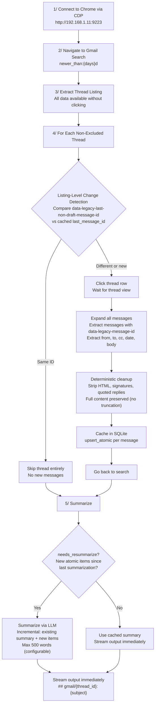
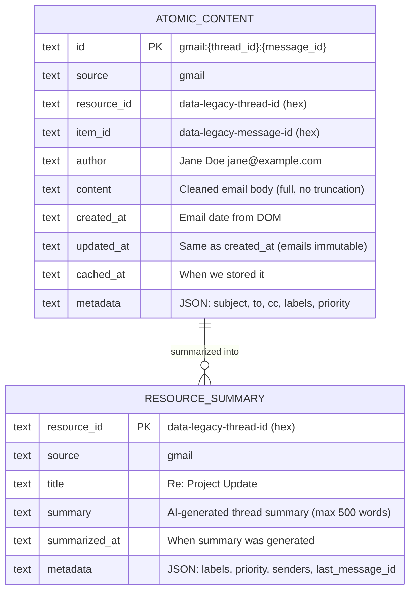
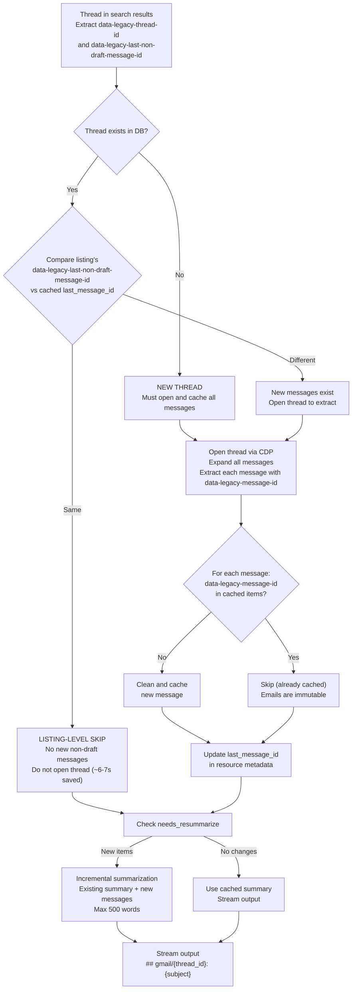
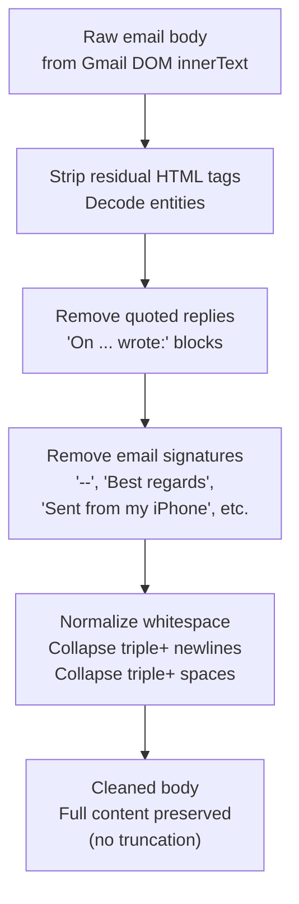
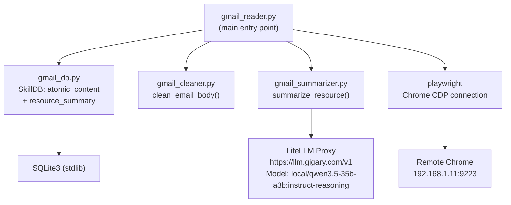

# Gmail Skill - Architecture

> Replaces `gmail-thread-reader`. Self-contained with SQLite caching, incremental fetching, and AI summarization.
> All dependencies (DB, cleaner, summarizer) are embedded in `scripts/`.

## High-Level Flow



## Data Available at Thread Listing (Without Opening Thread)

All of the following are extracted from `<SPAN>` elements inside each `tr[jscontroller]` row:

| Field | DOM Source | Example | Notes |
|---|---|---|---|
| `data-legacy-thread-id` | `span[data-legacy-thread-id]` | `19ceb94ec915103d` | **Stable thread ID (hex)** - our `resource_id` |
| `data-legacy-last-non-draft-message-id` | `span[data-legacy-last-non-draft-message-id]` | `19cf12e94c0556b8` | **Last message ID** - for change detection |
| subject | `span.bog` in `tds[5]` | Full subject text | Thread subject |
| senders | `span[email]` elements | Name + email pairs | All thread participants |
| labels | `div.at` elements | Inbox, custom labels | Gmail labels |
| date | `tds[8] span[title]` | `Sun, Mar 15, 2026, 11:08 AM` | Date of most recent message |
| snippet | `span.y2` in `tds[5]` | ~120 chars | Preview of latest message |

## Data Available Inside Thread (After Clicking)

| Field | DOM Source | Example | Notes |
|---|---|---|---|
| `data-legacy-thread-id` | `h2.hP[data-legacy-thread-id]` | `19ceb94ec915103d` | Same as listing (confirmation) |
| `data-legacy-message-id` | `div.adn[data-legacy-message-id]` | `19ceb94ec915103d` | **Per-message ID (hex)** - our `item_id` |
| subject | `h2.hP` text content | Full thread subject | |
| from (per message) | `span.gD[email]` | Name + email | Message sender |
| to, cc (per message) | `table.ajB` detail rows | Name + email lists | Recipients |
| date (per message) | `span.g3[title]` | `Mar 14, 2026, 9:02 AM` | Message timestamp |
| body (per message) | `div.a3s.aiL` or `div.a3s` | Full email body | Cleaned before caching |

## ID Conventions

All IDs use the **legacy hex format** for consistency (since listing-level data uses legacy format).

| Concept | Value | Example |
|---|---|---|
| `resource_id` | `data-legacy-thread-id` | `19ceb94ec915103d` |
| `item_id` | `data-legacy-message-id` | `19ceb94ec915103d` |
| Change detection key | `data-legacy-last-non-draft-message-id` | `19cf12e94c0556b8` |
| Composite key | `gmail:{resource_id}:{item_id}` | `gmail:19ceb94ec915103d:19ceb94ec915103d` |

Note: The first message in a thread shares the same legacy ID as the thread itself (thread_id == first_message_id).

## Data Model



## Change Detection Flow



## Email Immutability

Gmail messages are **immutable once sent** - body content never changes. Threads grow only by new replies. This simplifies our logic:
- If `data-legacy-last-non-draft-message-id` matches cached value -> no new messages -> skip entirely
- If it differs -> new messages added -> open thread, cache ONLY new messages
- Existing cached messages never need re-fetching or updating
- No need for `updated_at` comparison per message (unlike Jira where comments can be edited)

## Deterministic Cleanup Pipeline



## Output Format

Each thread is streamed to stdout immediately when its summary is ready:

```
## gmail/19ceb94ec915103d: Re: Project Update
Source: gmail | Thread: 19ceb94ec915103d | Labels: Inbox, IMPORTANT | Priority: IMPORTANT | Senders: Jane Doe, Bob Smith | Last Date: Sun, Mar 15, 2026, 11:08 AM
[AI-generated summary - participants, key decisions, action items, timeline, max 500 words]
```

- Each block streamed with `print(..., flush=True)`
- Use `PYTHONUNBUFFERED=1 python3 -u` for real-time streaming to file
- Progress and diagnostics go to stderr
- No `---` separators (saves tokens)

## File Structure

```
gmail/
├── SKILL.md                  # Agent-facing documentation
├── _architecture.md          # This file (human-facing design)
├── data/
│   ├── .gitignore            # Excludes *.db from git
│   └── gmail_cache.db        # SQLite (auto-created at runtime)
└── scripts/
    ├── gmail_reader.py       # Main script: CDP + listing + caching + output
    ├── gmail_db.py           # Self-contained SQLite DB management
    ├── gmail_cleaner.py      # Self-contained email body cleanup
    └── gmail_summarizer.py   # Self-contained LLM summarization via LiteLLM
```

## Module Dependencies



## Arguments

| Argument | Default | Description |
|---|---|---|
| `--cdp-url` | `http://192.168.1.11:9223` | Chrome DevTools Protocol endpoint |
| `--days` | `3` | Days to look back |
| `--max-threads` | `20` | Max non-excluded threads to read |
| `--max-scan` | `100` | Max total threads to scan (safety cap) |
| `--exclude-labels` | `["❌ ai-exclusion", "🪣 Bitbucket"]` | JSON array of labels to skip |
| `--priority-labels` | `["⚠️IMPORTANT", ...]` | JSON array of priority labels (highest first) |
| `--force` | `false` | Bypass change detection, re-fetch and re-summarize all |

## Metadata Captured

| Field | Source | Stored In |
|---|---|---|
| thread_id (resource_id) | `data-legacy-thread-id` from listing | All tables |
| last_message_id | `data-legacy-last-non-draft-message-id` from listing | resource_summary metadata |
| message_id (item_id) | `data-legacy-message-id` from thread view | atomic_content |
| subject | `span.bog` at listing / `h2.hP` in thread | resource_summary title |
| senders | `span[email]` at listing | resource_summary metadata |
| labels | `div.at` at listing | atomic metadata + summary metadata |
| priority | Matched from priority_labels config | summary metadata |
| from, to, cc | Per-message headers in thread view | atomic metadata |
| date | Per-message `span.g3[title]` | atomic created_at/updated_at |
| snippet | `span.y2` at listing (~120 chars) | Not stored (full body cached instead) |

## Environment Variables

| Variable | Required | Default | Purpose |
|---|---|---|---|
| `API_KEY_OTHER` / `LLAMA_TOKEN` | Yes | - | LiteLLM proxy auth (set via Terraform, or LLAMA_TOKEN) |
| `LITELLM_BASE_URL` | No | `https://llm.gigary.com/v1` | LiteLLM proxy endpoint |
| `SUMMARIZE_MODEL` | No | `local/qwen3.5-35b-a3b:instruct-reasoning` | LLM model for summarization |
| `MAX_SUMMARY_WORDS` | No | `500` | Max words per summary (in prompt) |

## Token Reduction Estimates

| Stage | Input | Output | Reduction |
|---|---|---|---|
| Raw Gmail extraction (20 threads) | ~217-432KB (54-108K tokens) | - | - |
| Layer 1: Deterministic cleanup | 54-108K tokens | ~25-50K tokens | ~50% |
| Layer 2: Skip unchanged threads (re-run) | 25-50K tokens | 0 (cached) | 100% |
| Layer 3: AI summarization | 25-50K tokens | ~10K tokens (20 x 500 words) | ~80% |
| **Total (first run)** | **54-108K tokens** | **~10K tokens** | **~90%** |
| **Total (re-run, no changes)** | **54-108K tokens** | **~0 processing** | **~100%** |

## Key Differences from Jira Skill

| Aspect | Jira | Gmail |
|---|---|---|
| Data source | REST API | Chrome CDP (browser automation) |
| Resource ID | Ticket key (DPD-645) | `data-legacy-thread-id` (hex) |
| Item ID | Ticket key or comment ID | `data-legacy-message-id` (hex) |
| Content mutability | Mutable (comments can be edited) | **Immutable** (emails never change) |
| Listing-level ID | Available (ticket key in API) | Available (`data-legacy-thread-id`) |
| Change detection | `updated_at` timestamp comparison | `data-legacy-last-non-draft-message-id` comparison |
| Relationships | parent/child/blocks/linked tickets | None (flat thread structure) |
| Speed bottleneck | API rate limits | Browser navigation (~6-7s/thread) |
