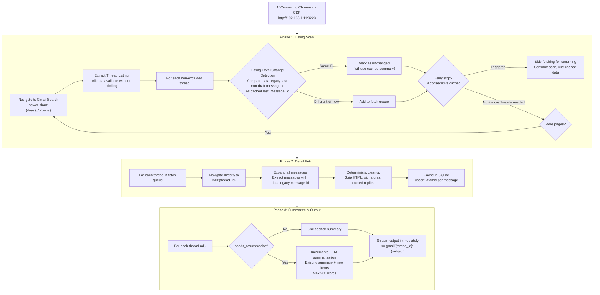
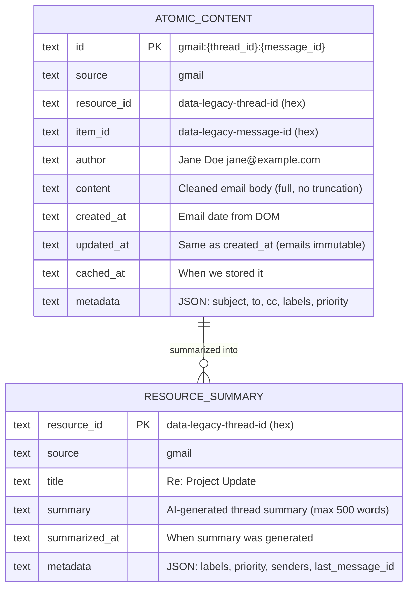
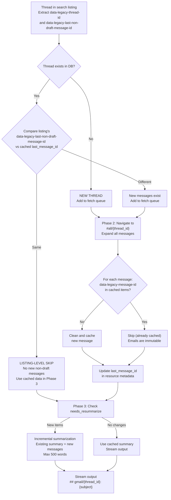
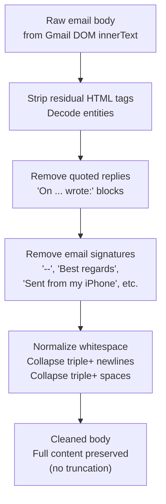
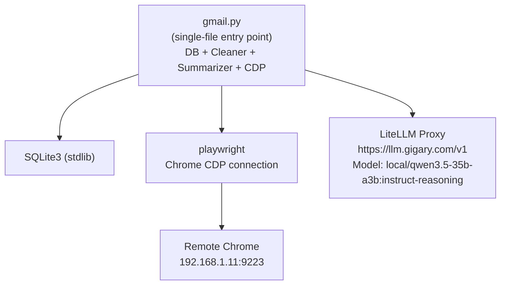

# Gmail Skill - Architecture

> Replaces `gmail-thread-reader`. Self-contained with SQLite caching, incremental fetching, and AI summarization.
> All dependencies (DB, cleaner, summarizer) are embedded in `scripts/`.

## High-Level Flow (Two-Phase Architecture)



### Why Two Phases?

1. **Phase 1 (Listing Scan)** collects all thread metadata by paginating through search results via URL (`/pN`). No threads are opened - only DOM attributes from listing rows.
2. **Phase 2 (Detail Fetch)** navigates directly to each thread URL (`#all/{thread_id}`) for content extraction. This avoids back-navigation issues and pagination state corruption.
3. **Phase 3 (Summarize)** processes all threads (cached + newly fetched) and streams output.

### Pagination

Gmail search results are paginated using URL hash suffix: `#search/newer_than%3A{days}d/p{page_num}`. Page 1 has no suffix; page 2+ uses `/pN`. Each page shows ~100 threads. The script navigates to successive pages until `max-threads` or `max-scan` is reached.

### Early Stop

Configurable via `--early-stop N` (default: 5, 0=disabled). When N consecutive threads are found unchanged in the DB, fetching stops but listing scan continues. All remaining threads are treated as unchanged and included in the output using cached data. This preserves the full response while skipping expensive detail fetches.

## Data Available at Thread Listing (Without Opening Thread)

All of the following are extracted from `<SPAN>` elements inside each `tr[jscontroller]` row:

| Field | DOM Source | Example | Notes |
|---|---|---|---|
| `data-legacy-thread-id` | `span[data-legacy-thread-id]` | `19ceb94ec915103d` | **Stable thread ID (hex)** - our `resource_id` |
| `data-legacy-last-non-draft-message-id` | `span[data-legacy-last-non-draft-message-id]` | `19cf12e94c0556b8` | **Last message ID** - for change detection |
| subject | `span.bog` in `tds[5]` | Full subject text | Thread subject |
| senders | `span[email]` elements | Name + email pairs | All thread participants |
| labels | `div.at` elements | Inbox, custom labels | Gmail labels |
| date | `tds[8] span[title]` | `Sun, Mar 15, 2026, 11:08 AM` | Date of most recent message |
| snippet | `span.y2` in `tds[5]` | ~120 chars | Preview of latest message |

## Data Available Inside Thread (After Clicking)

| Field | DOM Source | Example | Notes |
|---|---|---|---|
| `data-legacy-thread-id` | `h2.hP[data-legacy-thread-id]` | `19ceb94ec915103d` | Same as listing (confirmation) |
| `data-legacy-message-id` | `div.adn[data-legacy-message-id]` | `19ceb94ec915103d` | **Per-message ID (hex)** - our `item_id` |
| subject | `h2.hP` text content | Full thread subject | |
| from (per message) | `span.gD[email]` | Name + email | Message sender |
| to, cc (per message) | `table.ajB` detail rows | Name + email lists | Recipients |
| date (per message) | `span.g3[title]` | `Mar 14, 2026, 9:02 AM` | Message timestamp |
| body (per message) | `div.a3s.aiL` or `div.a3s` | Full email body | Cleaned before caching |

## ID Conventions

All IDs use the **legacy hex format** for consistency (since listing-level data uses legacy format).

| Concept | Value | Example |
|---|---|---|
| `resource_id` | `data-legacy-thread-id` | `19ceb94ec915103d` |
| `item_id` | `data-legacy-message-id` | `19ceb94ec915103d` |
| Change detection key | `data-legacy-last-non-draft-message-id` | `19cf12e94c0556b8` |
| Composite key | `gmail:{resource_id}:{item_id}` | `gmail:19ceb94ec915103d:19ceb94ec915103d` |

Note: The first message in a thread shares the same legacy ID as the thread itself (thread_id == first_message_id).

## Data Model



## Change Detection Flow



## Email Immutability

Gmail messages are **immutable once sent** - body content never changes. Threads grow only by new replies. This simplifies our logic:
- If `data-legacy-last-non-draft-message-id` matches cached value -> no new messages -> skip entirely
- If it differs -> new messages added -> open thread, cache ONLY new messages
- Existing cached messages never need re-fetching or updating
- No need for `updated_at` comparison per message (unlike Jira where comments can be edited)

## Deterministic Cleanup Pipeline



## Output Format

Each thread is streamed to stdout immediately when its summary is ready:

```
## gmail/19ceb94ec915103d: Re: Project Update
Source: gmail | Thread: 19ceb94ec915103d | Labels: Inbox, IMPORTANT | Priority: IMPORTANT | Senders: Jane Doe, Bob Smith | Last Date: Sun, Mar 15, 2026, 11:08 AM
[AI-generated summary - participants, key decisions, action items, timeline, max 500 words]
```

- Each block streamed with `print(..., flush=True)`
- Use `PYTHONUNBUFFERED=1 python3 -u` for real-time streaming to file
- Progress and diagnostics go to stderr
- No `---` separators (saves tokens)

## File Structure

```
gmail/
├── SKILL.md                  # Agent-facing documentation
├── _architecture.md          # This file (human-facing design)
├── Makefile                  # Test/coverage targets
├── data/
│   └── gmail_cache.db        # SQLite (persistent, auto-created at runtime)
└── scripts/
    ├── gmail.py              # Single-file entry point: CDP + DB + cleaner + summarizer + output
    └── test_gmail.py         # Comprehensive test suite (90 tests, 212 subtests, 95% coverage)
# Transactional output → /a0/usr/workdir/gmail-output.md, gmail-debug.log
```

## Module Dependencies



## Arguments

| Argument | Default | Description |
|---|---|---|
| `--cdp-url` | `http://192.168.1.11:9223` | Chrome DevTools Protocol endpoint |
| `--days` | `3` | Days to look back |
| `--max-threads` | `50` | Max non-excluded threads to process |
| `--max-scan` | `100` | Max total threads to scan across all pages (safety cap) |
| `--early-stop` | `5` | Stop fetching after N consecutive cached threads; scan continues, output includes all (0=disabled) |
| `--exclude-labels` | `["❌ ai-exclusion", "🪣 Bitbucket"]` | JSON array of labels to skip |
| `--priority-labels` | `["⚠️IMPORTANT", ...]` | JSON array of priority labels (highest first) |
| `--cached-only` | `false` | Output cached summaries from DB without browser (fast, for reports) |
| `--force` | `false` | Bypass change detection, re-fetch and re-summarize all |
| `--output` | `workdir/gmail-output.md` | Write results to file (clean markdown for AI agents) |
| `--debug-log` | `workdir/gmail-debug.log` | Write debug/progress messages to file |

## Metadata Captured

| Field | Source | Stored In |
|---|---|---|
| thread_id (resource_id) | `data-legacy-thread-id` from listing | All tables |
| last_message_id | `data-legacy-last-non-draft-message-id` from listing | resource_summary metadata |
| message_id (item_id) | `data-legacy-message-id` from thread view | atomic_content |
| subject | `span.bog` at listing / `h2.hP` in thread | resource_summary title |
| senders | `span[email]` at listing | resource_summary metadata |
| labels | `div.at` at listing | atomic metadata + summary metadata |
| priority | Matched from priority_labels config | summary metadata |
| from, to, cc | Per-message headers in thread view | atomic metadata |
| date | Per-message `span.g3[title]` | atomic created_at/updated_at |
| snippet | `span.y2` at listing (~120 chars) | Not stored (full body cached instead) |

## Environment Variables

| Variable | Required | Default | Purpose |
|---|---|---|---|
| `API_KEY_OTHER` / `LLAMA_TOKEN` | Yes | - | LiteLLM proxy auth (set via Terraform, or LLAMA_TOKEN) |
| `LITELLM_BASE_URL` | No | `https://llm.gigary.com/v1` | LiteLLM proxy endpoint |
| `SUMMARIZE_MODEL` | No | `local/qwen3.5-35b-a3b:instruct-reasoning` | LLM model for summarization |
| `MAX_SUMMARY_WORDS` | No | `500` | Max words per summary (in prompt) |

## Token Reduction Estimates

| Stage | Input | Output | Reduction |
|---|---|---|---|
| Raw Gmail extraction (100 threads, 7 days) | ~500K-1MB (125-250K tokens) | - | - |
| Layer 1: Deterministic cleanup | 125-250K tokens | ~60-120K tokens | ~50% |
| Layer 2: Skip unchanged threads (re-run) | 60-120K tokens | 0 (cached) | 100% |
| Layer 3: AI summarization | 60-120K tokens | ~50K tokens (100 x 500 words) | ~60% |
| **Total (first run)** | **125-250K tokens** | **~50K tokens** | **~80%** |
| **Total (re-run, no changes)** | **125-250K tokens** | **~0 processing, ~50K cached output** | **~100%** |

Performance: First run ~37min (102 threads). Re-run with cache: ~2min (3 new threads out of 105).

## Data Accuracy & Integrity

### Race Condition Prevention

Gmail is a Single Page Application (SPA) - hash navigation (`#all/{thread_id}`) does not trigger a page reload. This creates a race condition: after `page.goto()`, the DOM may still show the previous thread's content.

**Solution:** `navigate_to_thread()` actively polls `page.evaluate()` until `data-legacy-thread-id` on the page matches the expected thread ID, with exponential backoff (0.3s to 1.0s). If polling times out:
1. Reset SPA state by navigating to inbox, then retry
2. Full page reload, then retry
3. Skip thread after 3 failed attempts (logged as warning)

**Cross-thread leakage prevention:** `has_message_anywhere()` checks if a message ID already belongs to another thread before caching. Prevents duplicate messages from appearing in wrong threads when SPA serves stale DOM.

### Date Parsing

Gmail DOM renders dates with locale-specific formatting including Unicode whitespace characters (e.g., `\u202f` NARROW NO-BREAK SPACE before AM/PM). `parse_gmail_date()` normalizes these to regular spaces before parsing with `strptime`.

### 25-Point Integrity Checklist

Run against the production database after each major data ingestion:

| # | Check | What It Validates |
|---|---|---|
| 1 | Composite PK format | Every `id` matches pattern `gmail:{resource_id}:{item_id}` |
| 2 | Item uniqueness per thread | No duplicate `item_id` within a single `resource_id` |
| 3 | No cross-thread leakage | Each `item_id` appears in exactly one `resource_id` |
| 4 | Metadata JSON valid | All metadata fields parse as valid JSON with `to`, `cc`, `subject` |
| 5 | Timestamps valid ISO 8601 | All `created_at`, `updated_at`, `cached_at` are parseable ISO timestamps |
| 6 | Referential integrity | Every `resource_summary.resource_id` has matching `atomic_content` rows |
| 7 | Title matches subject | `resource_summary.title` equals `metadata.subject` in atomic content |
| 8 | Last message ID correct | `last_message_id` in summary metadata is the actual latest cached `item_id` |
| 9 | No NULL/empty fields | Critical fields (`source`, `resource_id`, `item_id`, `cached_at`) never empty |
| 10 | Summaries complete | All summaries have `title`, `summary`, `summarized_at`, `final_relevance > 0` |
| 11 | Content clean | No raw HTML tags (`<div>`, `<span>`, etc.) in cleaned body content |
| 12 | Author field present | Every atomic row has a non-empty `author` |
| 13 | Mention type valid | Values are exactly `direct`, `indirect`, or `none` |
| 14 | Multi-message ordering | Within threads, `created_at` is chronological |
| 15 | Content duplication | Flag identical body content across different items (expected for templated alerts) |
| 16 | Email addresses valid | `to` and `cc` fields contain objects with `name` and `email` keys |
| 17 | HARD CAP respected | System-generated emails score <= 7 |
| 18 | PERSONAL floor respected | Direct human-written emails score >= 7 |
| 19 | Scoring range | All `final_relevance` values between 1 and 10 |
| 20 | Spot-check coherence | Summary text relates to email subject and content |
| 21 | Summary word count | Summaries between 10-500 words |
| 22 | No duplicate resource IDs | Each thread appears exactly once in `resource_summary` |
| 23 | Thread meta consistency | `last_message_id` in atomic metadata matches summary metadata |
| 24 | Cached timestamps recent | `cached_at` values are within the expected ingestion window |
| 25 | Mention distribution | Proportion of direct/indirect/none is sensible for the dataset |

### Relevance Scoring (3-Tier)

LLM-based scoring with decision tree prompt:

| Tier | Examples | Score Range |
|---|---|---|
| **PERSONAL** - human wrote directly to/about user | IT requests, discussion invites, SLO reviews | 7-10 |
| **ACTION-REQUIRED** - automated but user needs to act | Access requests, approval requests, calendar invites needing response | 6-8 |
| **INFORMATIONAL** - automated, no action needed | Dashboard reports, delivery failures, daily agenda, accepted/declined | 5-7 |
| **Indirect** - user in CC or mentioned tangentially | Group announcements, FYI threads | 5-7 |
| **None** - no user involvement | Spam, irrelevant threads | 1-4 |

**HARD CAP:** System-generated emails (calendar invites, auto-replies, Opsgenie alerts, Datadog reports) must not exceed score 7 regardless of content.

### Test Coverage

- **90 tests, 212 subtests, 95% code coverage**
- Behavioral tests cover: date parsing edge cases, Unicode normalization, concurrent DB access, thread safety, SPA race conditions, LLM retry logic, relevance floor clamping, cross-thread leakage detection, page mismatch handling, label truncation
- Run via `make test` or `make coverage` from the `gmail/` directory

## Key Differences from Jira Skill

| Aspect | Jira | Gmail |
|---|---|---|
| Data source | REST API | Chrome CDP (browser automation) |
| Resource ID | Ticket key (DPD-645) | `data-legacy-thread-id` (hex) |
| Item ID | Ticket key or comment ID | `data-legacy-message-id` (hex) |
| Content mutability | Mutable (comments can be edited) | **Immutable** (emails never change) |
| Listing-level ID | Available (ticket key in API) | Available (`data-legacy-thread-id`) |
| Change detection | `updated_at` timestamp comparison | `data-legacy-last-non-draft-message-id` comparison |
| Relationships | parent/child/blocks/linked tickets | None (flat thread structure) |
| Pagination | API `startAt` parameter | URL-based `/pN` hash suffix |
| Extraction strategy | Single-pass (API returns all) | Two-phase (listing scan + detail fetch) |
| Speed bottleneck | API rate limits | Browser navigation (~6-7s/thread) |
