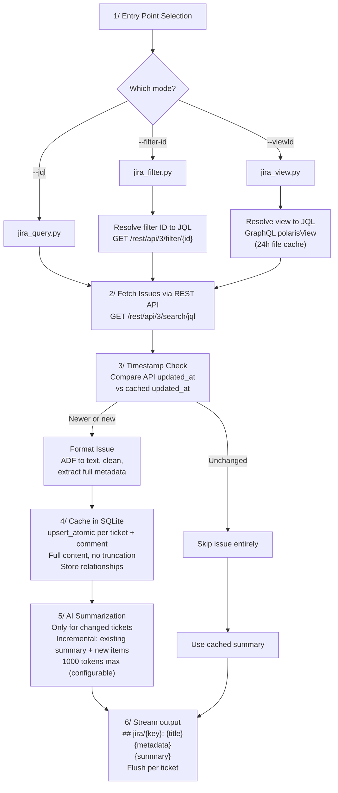
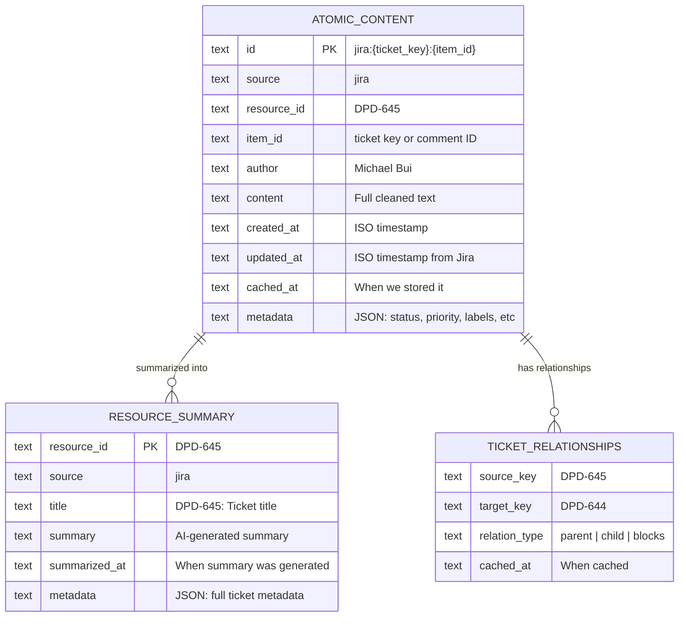
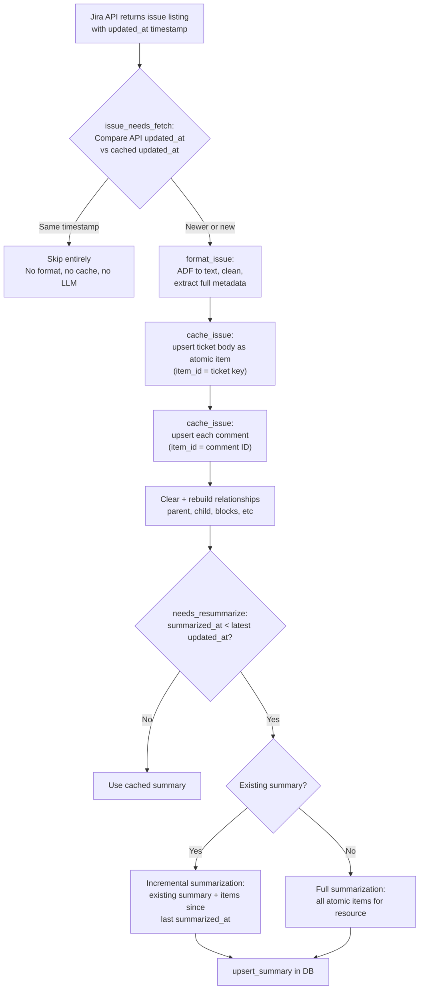
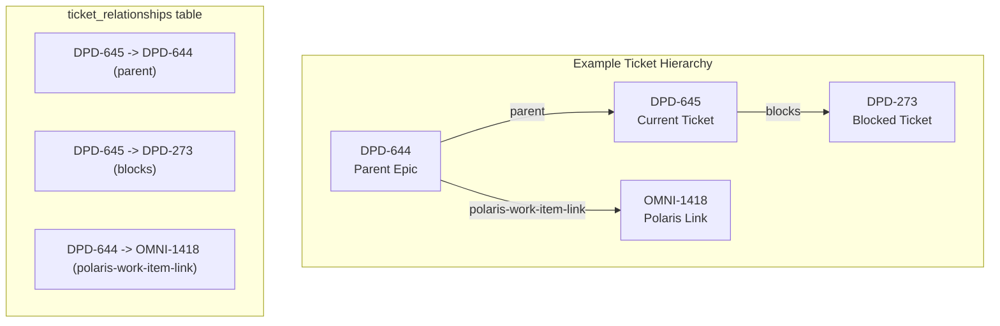
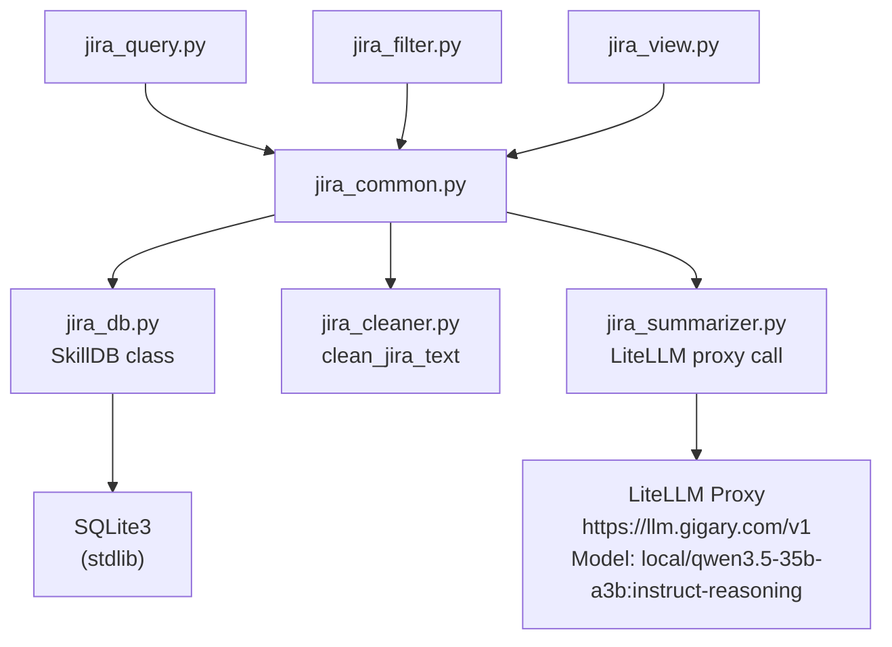

# Jira Skill - Architecture

> Combined skill replacing `jira-query-listing`, `jira-filter-listing`, and `jira-view-listing`.
> Self-contained - all dependencies (DB, cleaner, summarizer) are embedded in `scripts/`.

## High-Level Flow



## Data Model



## Change Detection Flow



## Incremental Summarization

When a ticket has an existing summary and new/updated content, the system provides both to the LLM:
1. Retrieves the existing summary text
2. Fetches only atomic items with `updated_at > summarized_at`
3. Sends both to the LLM with an "update" prompt that preserves historical context

This ensures old content outside the current API fetch window is not lost.

With `--force`, all atomic items are re-fetched and the full content is re-summarized regardless of timestamps.

## Relationship Tracking



## Output Format

Each ticket is streamed to stdout as it becomes ready (from cache or after LLM returns). Tickets are NOT batched - output is flushed immediately per ticket:

```
## jira/{key}: {title}
Source: jira | Key: {key} | Status: {status} ({category}) | Type: {type} | Priority: {priority} | Assignee: {assignee} | Reporter: {reporter} | Due: {date} | {relationships}
{AI-generated summary - current status, decisions, pending actions, key dates}
```

- Title in the database is stored without the key prefix (clean title only)
- Use `PYTHONUNBUFFERED=1 python3 -u` for real-time streaming to file
- Progress and diagnostics are written to stderr

## File Structure

```
jira/
├── SKILL.md                  # Agent-facing documentation
├── _architecture.md          # This file (human-facing design)
├── data/
│   └── jira_cache.db         # SQLite (persistent, auto-created at runtime)
└── scripts/
    ├── jira_common.py        # Core: auth, ADF, format, cache, summarize, output
    ├── jira_db.py            # Self-contained SQLite DB (SkillDB class)
    ├── jira_cleaner.py       # Self-contained text cleanup for Jira content
    ├── jira_summarizer.py    # Self-contained LLM summarization via LiteLLM
    ├── jira_query.py         # Entry: --jql
    ├── jira_filter.py        # Entry: --filter-id (resolves JQL via REST)
    └── jira_view.py          # Entry: --viewId (resolves JQL via GraphQL)
# Transactional output → /a0/usr/workdir/jira-output.md, jira-debug.log
```

## Module Dependencies



## Metadata Captured

| Field | Source | Stored In |
|---|---|---|
| status, status_category | fields.status | atomic metadata |
| assignee, reporter | fields.assignee/reporter.displayName | atomic metadata |
| priority | fields.priority.name | atomic metadata |
| issuetype | fields.issuetype.name | atomic metadata |
| resolution | fields.resolution.name | atomic metadata |
| duedate | fields.duedate | atomic metadata |
| labels | fields.labels | atomic metadata |
| components | fields.components[].name | atomic metadata |
| fix_versions | fields.fixVersions[].name | atomic metadata |
| parent_key | fields.parent.key | atomic metadata + relationships |
| subtask_keys | fields.subtasks[].key | atomic metadata + relationships |
| linked_issues | fields.issuelinks[].type + key | atomic metadata + relationships |

## Token Reduction Estimates

| Stage | Input | Output | Reduction |
|---|---|---|---|
| Raw Jira API response | ~86KB (~22K tokens) | - | - |
| Layer 1: Deterministic cleanup | 22K tokens | ~12K tokens | ~45% |
| Layer 2: Skip unchanged (re-run) | 12K tokens | 0 (cached) | 100% |
| Layer 3: AI summarization | 12K tokens | ~700 tokens (~500 words) | ~94% |
| **Total (first run)** | **22K tokens** | **~700 tokens** | **~97%** |
| **Total (re-run, no changes)** | **22K tokens** | **~0 processing** | **~100%** |

## Environment Variables

| Variable | Required | Default | Purpose |
|---|---|---|---|
| `JIRA_EMAIL` | Yes | - | Jira authentication email |
| `JIRA_API_KEY` | Yes | - | Jira API token |
| `LITELLM_API_KEY` / `API_KEY_OTHER` | Yes | - | LiteLLM proxy auth (set via Terraform) |
| `LITELLM_BASE_URL` | No | `https://llm.gigary.com/v1` | LiteLLM proxy endpoint |
| `SUMMARIZE_MODEL` | No | `local/qwen3.5-35b-a3b:instruct-reasoning` | LLM model for summarization |
| `MAX_SUMMARY_WORDS` | No | `500` | Max words per summary (in prompt) |
