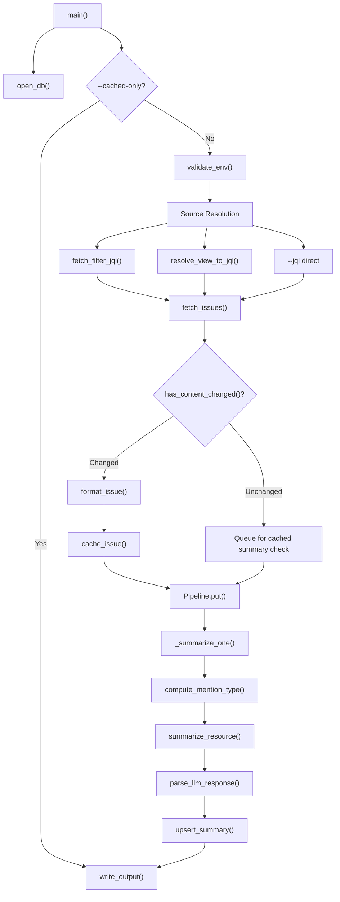
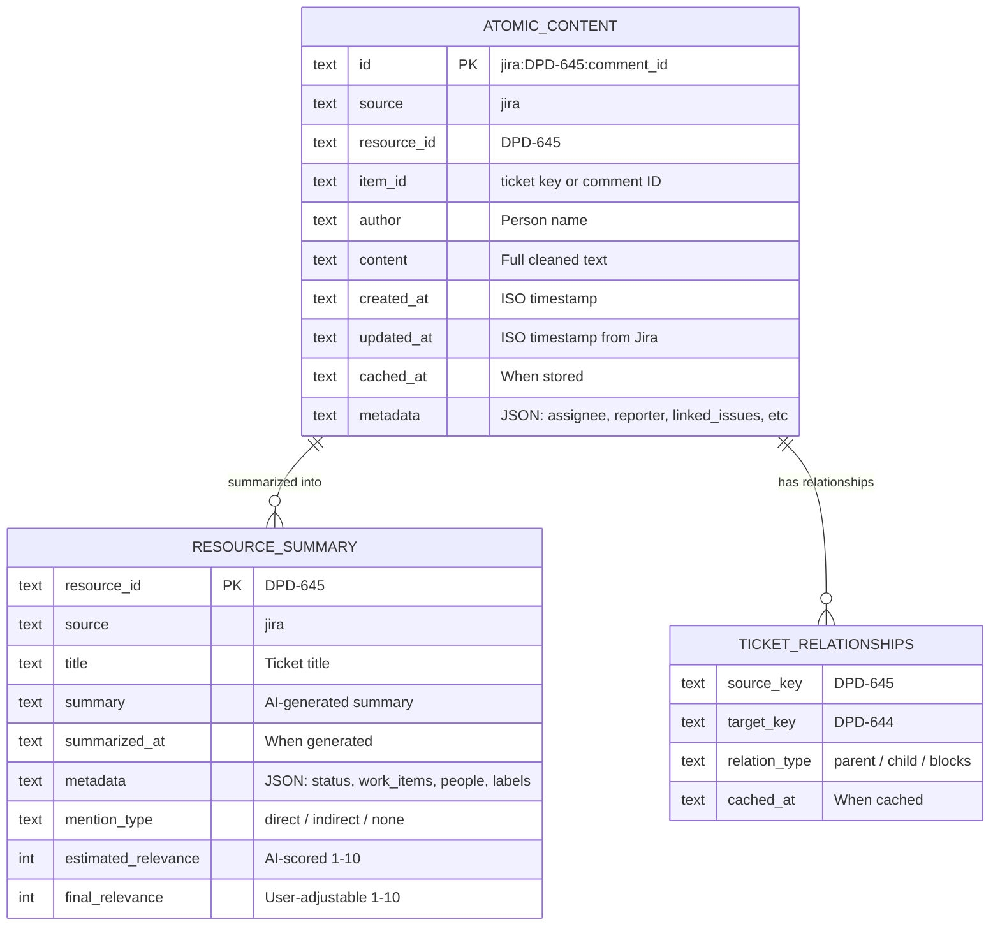

# Jira Skill - Architecture

> Single-file skill (`jira.py`) with SQLite caching, AI-driven relevance scoring, entity extraction, and adaptive summarization. Self-contained - no external shared modules.

## Processing Pipeline



## Public Method Dependencies

```mermaid
flowchart TD
    subgraph "Entry Point"
        main
    end

    subgraph "Database"
        open_db
        upsert_atomic["SkillDB.upsert_atomic()"]
        get_atomic["SkillDB.get_atomic_for_resource()"]
        get_latest["SkillDB.get_latest_updated_at()"]
        has_changed["SkillDB.has_content_changed()"]
        get_ids["SkillDB.get_all_resource_ids()"]
        get_summary["SkillDB.get_resource_summary()"]
        needs_resum["SkillDB.needs_resummarize()"]
        get_since["SkillDB.get_items_since()"]
        compute_mt["SkillDB.compute_mention_type()"]
        upsert_sum["SkillDB.upsert_summary()"]
        get_all_sum["SkillDB.get_all_summaries()"]
        backfill["SkillDB.backfill_mention_types()"]
        clear_sum["SkillDB.clear_all_summaries()"]
        upsert_rel["SkillDB.upsert_relationship()"]
        get_rels["SkillDB.get_relationships()"]
        clear_rels["SkillDB.clear_relationships()"]
        delete_res["SkillDB.delete_resource()"]
        close["SkillDB.close()"]
    end

    subgraph "Jira API"
        validate_env
        get_auth["get_auth_header()"]
        fetch_issues
        format_issue
        cache_issue
        adf_to_text
        clean["clean_jira_text()"]
    end

    subgraph "Source Resolvers"
        fetch_filter["fetch_filter_jql()"]
        resolve_view["resolve_view_to_jql()"]
    end

    subgraph "AI Summarizer"
        summarize_res["summarize_resource()"]
        parse_llm["parse_llm_response()"]
    end

    subgraph "Output"
        write_output
    end

    main --> open_db
    main --> validate_env
    main --> get_auth
    main --> fetch_filter
    main --> resolve_view
    main --> fetch_issues
    main --> has_changed
    main --> format_issue
    main --> cache_issue
    main --> write_output
    main --> close

    format_issue --> adf_to_text
    format_issue --> clean
    cache_issue --> upsert_atomic
    cache_issue --> clear_rels
    cache_issue --> upsert_rel

    summarize_res --> parse_llm
    write_output --> get_all_sum
    write_output --> get_rels
```



## Data Model



## Relevance Scoring

| Mention Type | Floor | Word Hint | Detection Signals |
|---|---|---|---|
| direct | 7 | ~200 words | assignee, reporter, comment author, @mention, name in content, user replied |
| indirect | 5 | ~100 words | linked issues, same epic, watcher |
| none | 1 | ~30 words | No user signal detected |

Strongest signal wins at resource level: 1 direct mention in 20 comments = `direct`.

## Entity Extraction (stored in `resource_summary.metadata` JSON)

| Field | Content |
|---|---|
| `work_items` | Jira ticket IDs, PR numbers, project codenames, service names, git repos |
| `people` | Explicit person names only (no groups/teams) |
| `labels` | 5 AI-generated 2-word descriptive labels (lowercase, hyphenated) |

## File Structure

```
jira/
├── SKILL.md              # Agent-facing documentation
├── _architecture.md      # This file
├── Makefile              # make test, make coverage
├── data/
│   └── jira_cache.db     # SQLite (persistent, auto-created)
└── scripts/
    ├── jira.py           # All logic (1278 lines)
    └── test_jira.py      # BDD test-table unit tests (95% coverage)
```

## Environment Variables

| Variable | Required | Default | Purpose |
|---|---|---|---|
| `JIRA_EMAIL` | Yes | - | Jira authentication email |
| `JIRA_API_KEY` | Yes | - | Jira API token |
| `API_KEY_OTHER` | Yes | - | LiteLLM proxy auth |
| `LITELLM_BASE_URL` | No | `https://llm.gigary.com/v1` | LiteLLM proxy endpoint |
| `SUMMARIZE_MODEL` | No | `local/qwen3.5-35b-a3b:instruct-reasoning` | LLM model |
| `JIRA_DB_PATH` | No | `data/jira_cache.db` | Override DB path (NFS workaround) |
